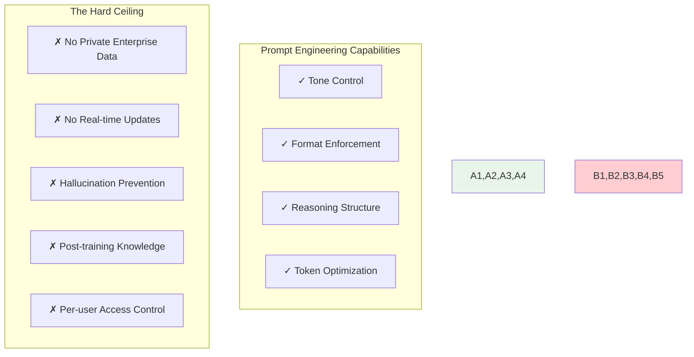

# Mermaid Diagram 10: Mermaid Diagram

```mermaid
graph TD
    subgraph "Prompt Engineering Capabilities"
        A1[✓ Tone Control]
        A2[✓ Format Enforcement]
        A3[✓ Reasoning Structure]
        A4[✓ Token Optimization]
    end
    
    subgraph "The Hard Ceiling"
        B1[✗ No Private Enterprise Data]
        B2[✗ No Real-time Updates]
        B3[✗ Hallucination Prevention]
        B4[✗ Post-training Knowledge]
        B5[✗ Per-user Access Control]
    end
    
    style A1,A2,A3,A4 fill:#e8f5e8
    style B1,B2,B3,B4,B5 fill:#ffcdd2
```
