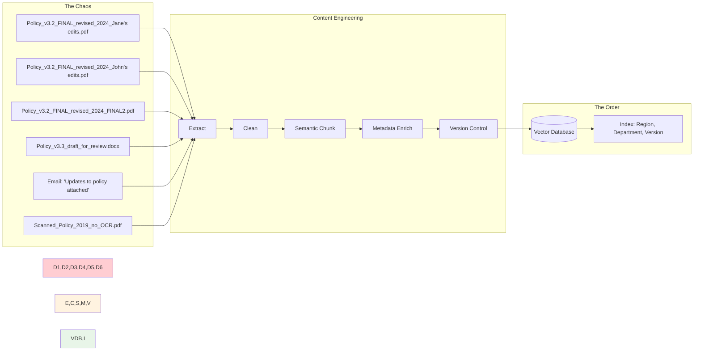

# Mermaid Diagram 11: Mermaid Diagram

```mermaid
flowchart LR
    subgraph "The Chaos"
        D1[Policy_v3.2_FINAL_revised_2024_Jane's edits.pdf]
        D2[Policy_v3.2_FINAL_revised_2024_John's edits.pdf]
        D3[Policy_v3.2_FINAL_revised_2024_FINAL2.pdf]
        D4[Policy_v3.3_draft_for_review.docx]
        D5[Email: 'Updates to policy attached']
        D6[Scanned_Policy_2019_no_OCR.pdf]
    end
    
    subgraph "Content Engineering"
        E[Extract]
        C[Clean]
        S[Semantic Chunk]
        M[Metadata Enrich]
        V[Version Control]
    end
    
    subgraph "The Order"
        VDB[(Vector Database)]
        I[Index: Region, Department, Version]
    end
    
    D1 & D2 & D3 & D4 & D5 & D6 --> E
    E --> C --> S --> M --> V --> VDB
    VDB --> I
    
    style D1,D2,D3,D4,D5,D6 fill:#ffcdd2
    style E,C,S,M,V fill:#fff3e0
    style VDB,I fill:#e8f5e8
```
