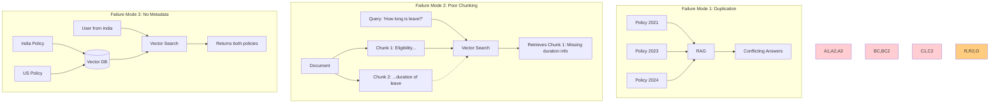

# Mermaid Diagram 12: Mermaid Diagram

```mermaid
graph TD
    subgraph "Failure Mode 1: Duplication"
        A1[Policy 2021] --> RAG
        A2[Policy 2023] --> RAG
        A3[Policy 2024] --> RAG
        RAG --> O[Conflicting Answers]
    end
    
    subgraph "Failure Mode 2: Poor Chunking"
        B[Document] --> BC[Chunk 1: Eligibility...]
        B --> BC2[Chunk 2: ...duration of leave]
        Q[Query: 'How long is leave?'] --> VS[Vector Search]
        BC --> VS
        BC2 -.-> VS
        VS --> R[Retrieves Chunk 1: Missing duration info]
    end
    
    subgraph "Failure Mode 3: No Metadata"
        C1[India Policy] --> V[(Vector DB)]
        C2[US Policy] --> V
        Q2[User from India] --> VS2[Vector Search]
        V --> VS2
        VS2 --> R2[Returns both policies]
    end
    
    style A1,A2,A3 fill:#ffcdd2
    style BC,BC2 fill:#ffcdd2
    style C1,C2 fill:#ffcdd2
    style R,R2,O fill:#ffcc80
```
