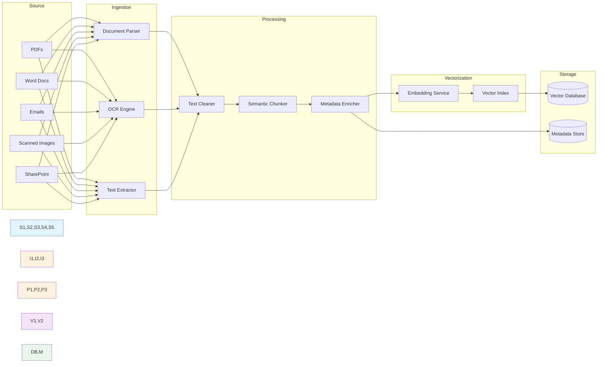

# Mermaid Diagram 13: Inconsistent formats

```mermaid
flowchart LR
    subgraph "Source"
        S1[PDFs]
        S2[Word Docs]
        S3[Emails]
        S4[Scanned Images]
        S5[SharePoint]
    end
    
    subgraph "Ingestion"
        I1[Document Parser]
        I2[OCR Engine]
        I3[Text Extractor]
    end
    
    subgraph "Processing"
        P1[Text Cleaner]
        P2[Semantic Chunker]
        P3[Metadata Enricher]
    end
    
    subgraph "Vectorization"
        V1[Embedding Service]
        V2[Vector Index]
    end
    
    subgraph "Storage"
        DB[(Vector Database)]
        M[(Metadata Store)]
    end
    
    S1 & S2 & S3 & S4 & S5 --> I1 & I2 & I3
    I1 & I2 & I3 --> P1
    P1 --> P2
    P2 --> P3
    P3 --> V1
    V1 --> V2
    V2 --> DB
    P3 --> M
    
    style S1,S2,S3,S4,S5 fill:#e1f5fe
    style I1,I2,I3 fill:#fff3e0
    style P1,P2,P3 fill:#fff3e0
    style V1,V2 fill:#f3e5f5
    style DB,M fill:#e8f5e8
```
