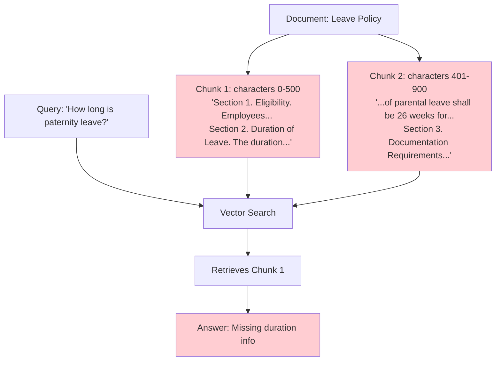

# Mermaid Diagram 14: Mermaid Diagram

```mermaid
graph TD
    D[Document: Leave Policy] --> C1["Chunk 1: characters 0-500
    'Section 1. Eligibility. Employees... 
    Section 2. Duration of Leave. The duration...'"]
    
    D --> C2["Chunk 2: characters 401-900
    '...of parental leave shall be 26 weeks for...
    Section 3. Documentation Requirements...'"]
    
    Q[Query: 'How long is paternity leave?'] --> VS[Vector Search]
    C1 --> VS
    C2 --> VS
    VS --> R[Retrieves Chunk 1]
    R --> A[Answer: Missing duration info]
    
    style C1 fill:#ffcdd2
    style C2 fill:#ffcdd2
    style A fill:#ffcdd2
```
