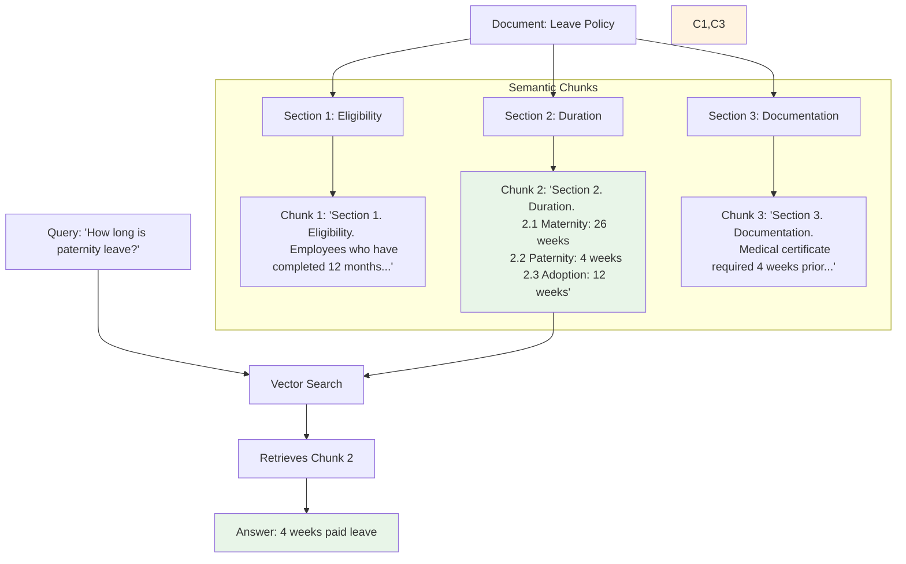

# Mermaid Diagram 15: Good Chunking (Semantic):

```mermaid
graph TD
    D[Document: Leave Policy] --> S1["Section 1: Eligibility"]
    D --> S2["Section 2: Duration"]
    D --> S3["Section 3: Documentation"]
    
    subgraph "Semantic Chunks"
        S1 --> C1["Chunk 1: 'Section 1. Eligibility. 
        Employees who have completed 12 months...'"]
        
        S2 --> C2["Chunk 2: 'Section 2. Duration. 
        2.1 Maternity: 26 weeks
        2.2 Paternity: 4 weeks
        2.3 Adoption: 12 weeks'"]
        
        S3 --> C3["Chunk 3: 'Section 3. Documentation.
        Medical certificate required 4 weeks prior...'"]
    end
    
    Q[Query: 'How long is paternity leave?'] --> VS[Vector Search]
    C2 --> VS
    VS --> R[Retrieves Chunk 2]
    R --> A[Answer: 4 weeks paid leave]
    
    style C2 fill:#e8f5e8
    style A fill:#e8f5e8
    style C1,C3 fill:#fff3e0
```
