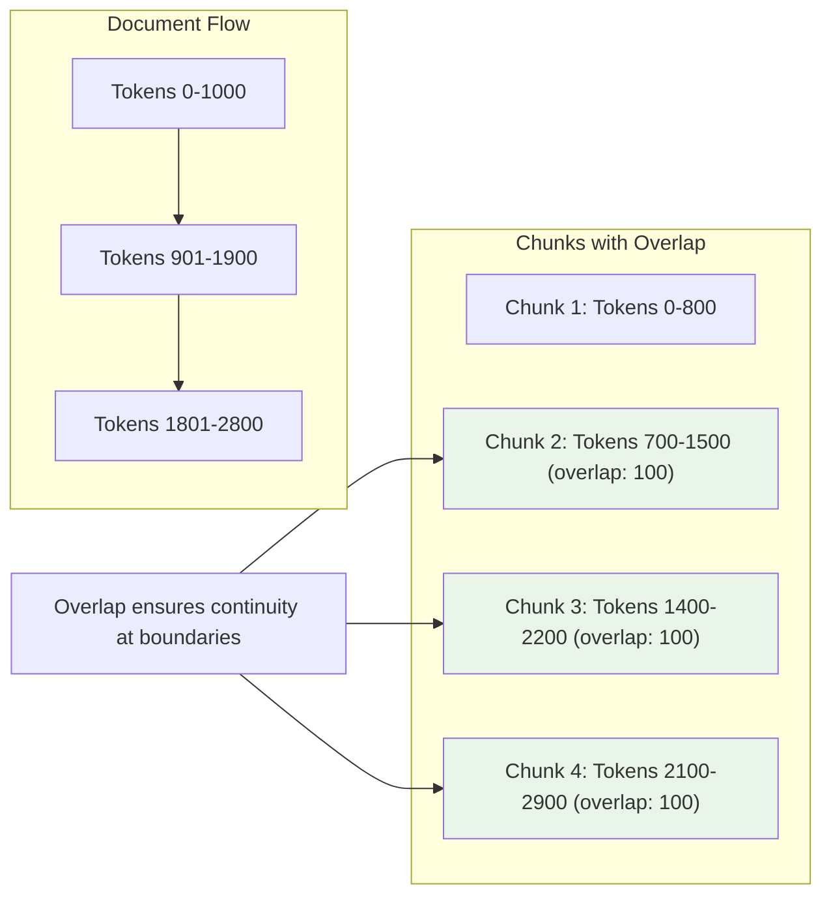

# Mermaid Diagram 16: Overlap Strategy:

```mermaid
flowchart LR
    subgraph "Document Flow"
        direction TB
        T1["Tokens 0-1000"] --> T2["Tokens 901-1900"]
        T2 --> T3["Tokens 1801-2800"]
    end
    
    subgraph "Chunks with Overlap"
        C1["Chunk 1: Tokens 0-800"]
        C2["Chunk 2: Tokens 700-1500 (overlap: 100)"]
        C3["Chunk 3: Tokens 1400-2200 (overlap: 100)"]
        C4["Chunk 4: Tokens 2100-2900 (overlap: 100)"]
    end
    
    O[Overlap ensures continuity at boundaries] --> C2 & C3 & C4
    
    style C2 fill:#e8f5e8
    style C3 fill:#e8f5e8
    style C4 fill:#e8f5e8
```
