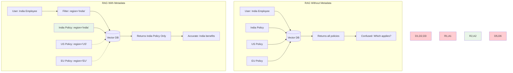

# Mermaid Diagram 17: Mermaid Diagram

```mermaid
flowchart TD
    subgraph "RAG Without Metadata"
        Q1[User: India Employee] --> V[(Vector DB)]
        D1[India Policy] --> V
        D2[US Policy] --> V
        D3[EU Policy] --> V
        V --> R1[Returns all policies]
        R1 --> A1[Confused: Which applies?]
    end
    
    subgraph "RAG With Metadata"
        Q2[User: India Employee] --> F[Filter: region='India']
        F --> V2[(Vector DB)]
        D4[India Policy: region='India'] --> V2
        D5[US Policy: region='US'] -.-> V2
        D6[EU Policy: region='EU'] -.-> V2
        V2 --> R2[Returns India Policy Only]
        R2 --> A2[Accurate: India benefits]
    end
    
    style D1,D2,D3 fill:#ffcdd2
    style R1,A1 fill:#ffcdd2
    style D4 fill:#e8f5e8
    style R2,A2 fill:#e8f5e8
    style D5,D6 fill:#ffcdd2
```
