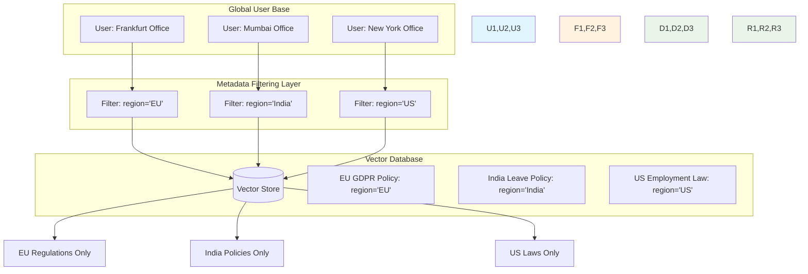

# Mermaid Diagram 18: Mermaid Diagram

```mermaid
flowchart TD
    subgraph "Global User Base"
        U1[User: Frankfurt Office]
        U2[User: Mumbai Office]
        U3[User: New York Office]
    end
    
    subgraph "Metadata Filtering Layer"
        F1[Filter: region='EU']
        F2[Filter: region='India']
        F3[Filter: region='US']
    end
    
    subgraph "Vector Database"
        DB[(Vector Store)]
        D1[EU GDPR Policy: region='EU']
        D2[India Leave Policy: region='India']
        D3[US Employment Law: region='US']
    end
    
    U1 --> F1 --> DB --> R1[EU Regulations Only]
    U2 --> F2 --> DB --> R2[India Policies Only]
    U3 --> F3 --> DB --> R3[US Laws Only]
    
    style U1,U2,U3 fill:#e1f5fe
    style F1,F2,F3 fill:#fff3e0
    style D1,D2,D3 fill:#e8f5e8
    style R1,R2,R3 fill:#e8f5e8
```
