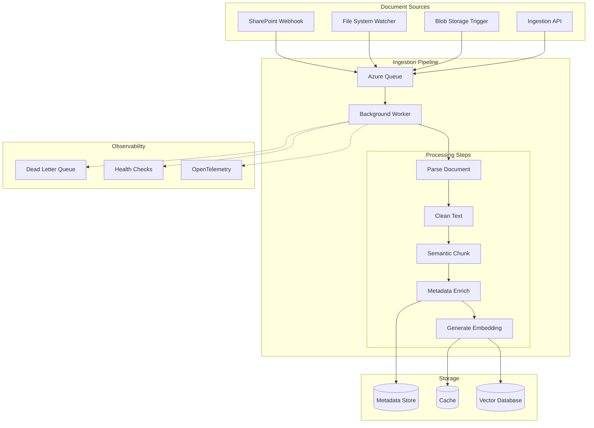

# Mermaid Diagram 19: Mermaid Diagram

```mermaid
flowchart TD
    subgraph "Document Sources"
        SP[SharePoint Webhook]
        FS[File System Watcher]
        B1[Blob Storage Trigger]
        API[Ingestion API]
    end

    subgraph "Ingestion Pipeline"
        Q[Azure Queue]
        W[Background Worker]
        
        subgraph "Processing Steps"
            P1[Parse Document]
            P2[Clean Text]
            P3[Semantic Chunk]
            P4[Metadata Enrich]
            P5[Generate Embedding]
        end
    end

    subgraph "Storage"
        VDB[(Vector Database)]
        MD[(Metadata Store)]
        C[(Cache)]
    end

    SP & FS & B1 & API --> Q
    Q --> W
    W --> P1 --> P2 --> P3 --> P4 --> P5
    P5 --> VDB
    P4 --> MD
    P5 --> C

    subgraph "Observability"
        O1[OpenTelemetry]
        O2[Health Checks]
        O3[Dead Letter Queue]
    end

    W -.-> O1 & O2 & O3
```
