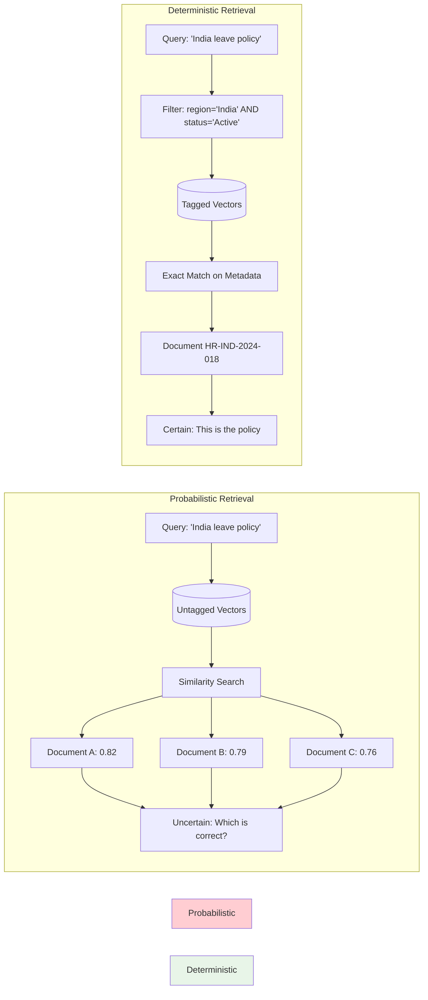

# Mermaid Diagram 20: 🔮 The Output: Deterministic Knowledge

```mermaid
flowchart LR
    subgraph "Probabilistic Retrieval"
        direction TB
        Q1[Query: 'India leave policy'] --> V1[(Untagged Vectors)]
        V1 --> S1[Similarity Search]
        S1 --> R1[Document A: 0.82]
        S1 --> R2[Document B: 0.79]
        S1 --> R3[Document C: 0.76]
        R1 & R2 & R3 --> U[Uncertain: Which is correct?]
    end
    
    subgraph "Deterministic Retrieval"
        direction TB
        Q2[Query: 'India leave policy'] --> F[Filter: region='India' AND status='Active']
        F --> V2[(Tagged Vectors)]
        V2 --> S2[Exact Match on Metadata]
        S2 --> R4[Document HR-IND-2024-018]
        R4 --> C[Certain: This is the policy]
    end
    
    style Probabilistic fill:#ffcdd2
    style Deterministic fill:#e8f5e8
```
