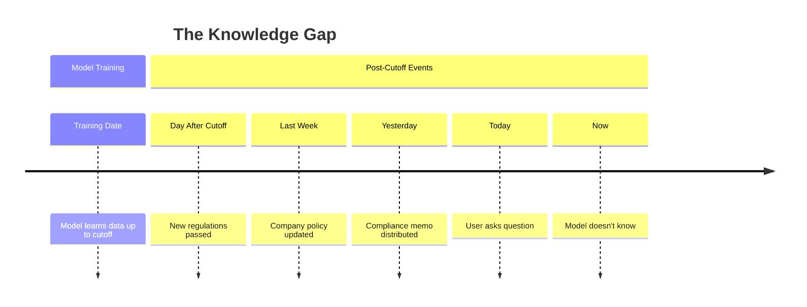

# Mermaid Diagram 21: *Connecting Models to Live Enterprise Knowledge*

```mermaid
timeline
    title The Knowledge Gap
    section Model Training
        Training Date : Model learns data up to cutoff
    section Post-Cutoff Events
        Day After Cutoff : New regulations passed
        Last Week : Company policy updated
        Yesterday : Compliance memo distributed
        Today : User asks question
        Now : Model doesn't know
```
