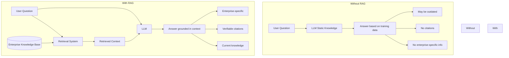

# Mermaid Diagram 22: Mermaid Diagram

```mermaid
flowchart TD
    subgraph "Without RAG"
        Q1[User Question] --> M1[LLM Static Knowledge]
        M1 --> A1[Answer based on training data]
        A1 --> P1[May be outdated]
        A1 --> P2[No citations]
        A1 --> P3[No enterprise-specific info]
    end
    
    subgraph "With RAG"
        Q2[User Question] --> R[Retrieval System]
        KB[(Enterprise Knowledge Base)] --> R
        R --> C[Retrieved Context]
        C --> M2[LLM]
        Q2 --> M2
        M2 --> A2[Answer grounded in context]
        A2 --> P4[Current knowledge]
        A2 --> P5[Verifiable citations]
        A2 --> P6[Enterprise-specific]
    end
    
    style Without RAG fill:#ffcdd2
    style With RAG fill:#e8f5e8
```
