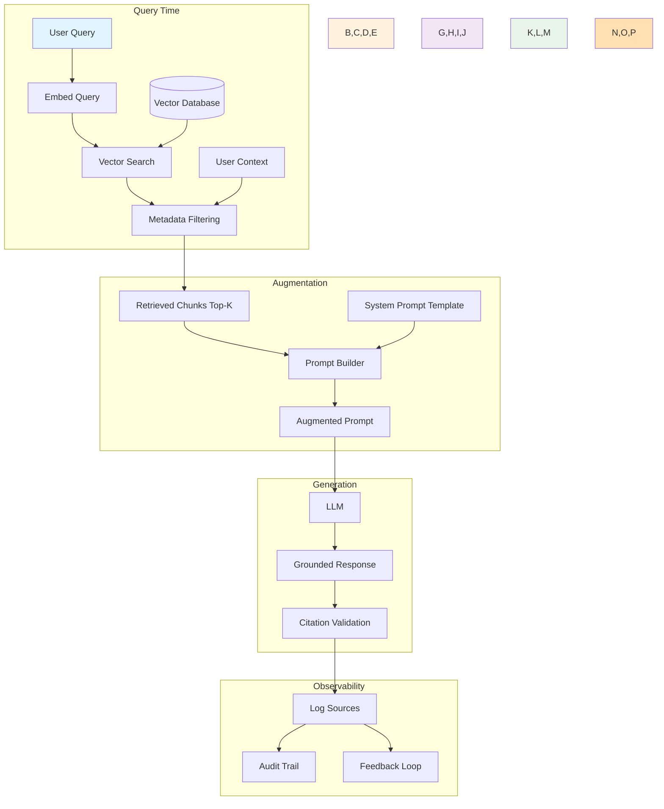

# Mermaid Diagram 23: 🔄 The RAG Pipeline: Step by Step

```mermaid
flowchart TD
    subgraph "Query Time"
        A[User Query] --> B[Embed Query]
        B --> C[Vector Search]
        D[(Vector Database)] --> C
        C --> E[Metadata Filtering]
        F[User Context] --> E
    end
    
    subgraph "Augmentation"
        E --> G[Retrieved Chunks Top-K]
        G --> H[Prompt Builder]
        I[System Prompt Template] --> H
        H --> J[Augmented Prompt]
    end
    
    subgraph "Generation"
        J --> K[LLM]
        K --> L[Grounded Response]
        L --> M[Citation Validation]
    end
    
    subgraph "Observability"
        M --> N[Log Sources]
        N --> O[Audit Trail]
        N --> P[Feedback Loop]
    end
    
    style A fill:#e1f5fe
    style B,C,D,E fill:#fff3e0
    style G,H,I,J fill:#f3e5f5
    style K,L,M fill:#e8f5e8
    style N,O,P fill:#ffe0b2
```
