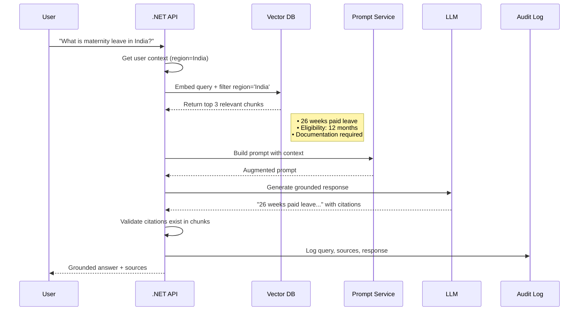

# Mermaid Diagram 24: Mermaid Diagram

```mermaid
sequenceDiagram
    participant User
    participant API as .NET API
    participant Vector as Vector DB
    participant Prompt as Prompt Service
    participant LLM
    participant Audit as Audit Log
    
    User->>API: "What is maternity leave in India?"
    
    API->>API: Get user context (region=India)
    API->>Vector: Embed query + filter region='India'
    
    Vector-->>API: Return top 3 relevant chunks
    Note right of Vector: • 26 weeks paid leave<br/>• Eligibility: 12 months<br/>• Documentation required
    
    API->>Prompt: Build prompt with context
    Prompt-->>API: Augmented prompt
    
    API->>LLM: Generate grounded response
    LLM-->>API: "26 weeks paid leave..." with citations
    
    API->>API: Validate citations exist in chunks
    API->>Audit: Log query, sources, response
    
    API-->>User: Grounded answer + sources
```
