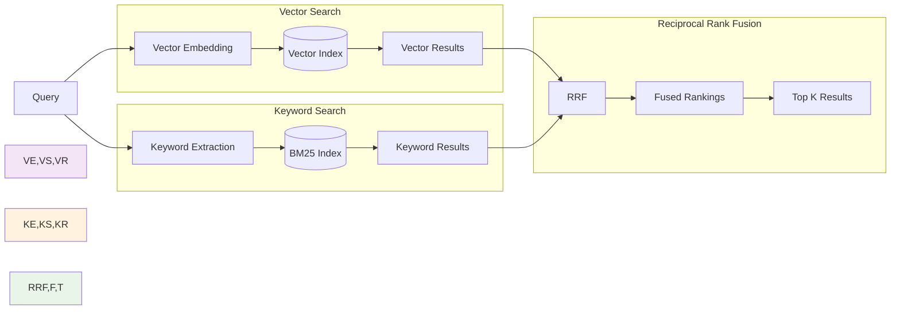

# Mermaid Diagram 25: Mermaid Diagram

```mermaid
flowchart LR
    Q[Query] --> VE[Vector Embedding]
    Q --> KE[Keyword Extraction]
    
    subgraph "Vector Search"
        VE --> VS[(Vector Index)]
        VS --> VR[Vector Results]
    end
    
    subgraph "Keyword Search"
        KE --> KS[(BM25 Index)]
        KS --> KR[Keyword Results]
    end
    
    subgraph "Reciprocal Rank Fusion"
        VR --> RRF
        KR --> RRF
        RRF --> F[Fused Rankings]
        F --> T[Top K Results]
    end
    
    style VE,VS,VR fill:#f3e5f5
    style KE,KS,KR fill:#fff3e0
    style RRF,F,T fill:#e8f5e8
```
