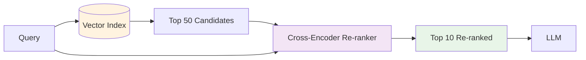

# Mermaid Diagram 26: Mermaid Diagram

```mermaid
flowchart LR
    Q[Query] --> VS[(Vector Index)]
    VS --> C50[Top 50 Candidates]
    C50 --> RR[Cross-Encoder Re-ranker]
    Q --> RR
    RR --> C10[Top 10 Re-ranked]
    C10 --> LLM
    
    style VS fill:#fff3e0
    style RR fill:#f3e5f5
    style C10 fill:#e8f5e8
```
