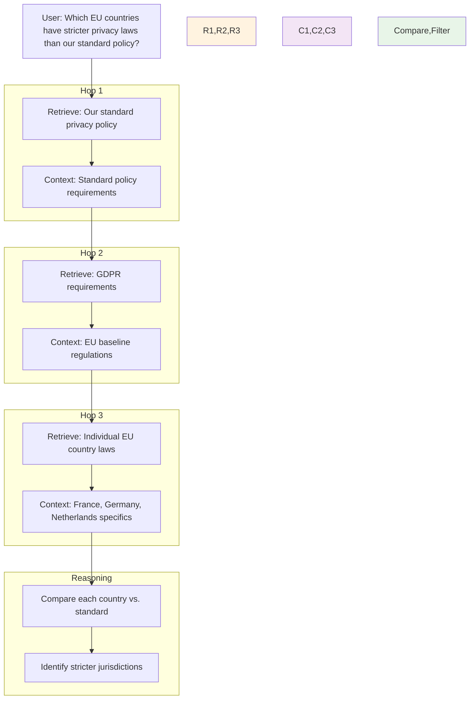

# Mermaid Diagram 27: Mermaid Diagram

```mermaid
flowchart TD
    Q[User: Which EU countries have stricter privacy laws than our standard policy?]
    
    subgraph "Hop 1"
        R1[Retrieve: Our standard privacy policy]
        C1[Context: Standard policy requirements]
    end
    
    subgraph "Hop 2"
        R2[Retrieve: GDPR requirements]
        C2[Context: EU baseline regulations]
    end
    
    subgraph "Hop 3"
        R3[Retrieve: Individual EU country laws]
        C3[Context: France, Germany, Netherlands specifics]
    end
    
    subgraph "Reasoning"
        Compare[Compare each country vs. standard]
        Filter[Identify stricter jurisdictions]
    end
    
    Q --> R1 --> C1 --> R2 --> C2 --> R3 --> C3 --> Compare --> Filter
    
    style R1,R2,R3 fill:#fff3e0
    style C1,C2,C3 fill:#f3e5f5
    style Compare,Filter fill:#e8f5e8
```
