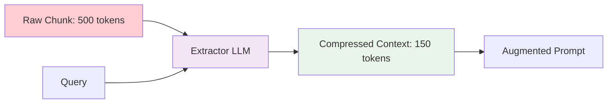

# Mermaid Diagram 28: 4. Context Compression

```mermaid
flowchart LR
    RC[Raw Chunk: 500 tokens] --> EX[Extractor LLM]
    Q[Query] --> EX
    EX --> CC[Compressed Context: 150 tokens]
    CC --> A[Augmented Prompt]
    
    style RC fill:#ffcdd2
    style EX fill:#f3e5f5
    style CC fill:#e8f5e8
```
