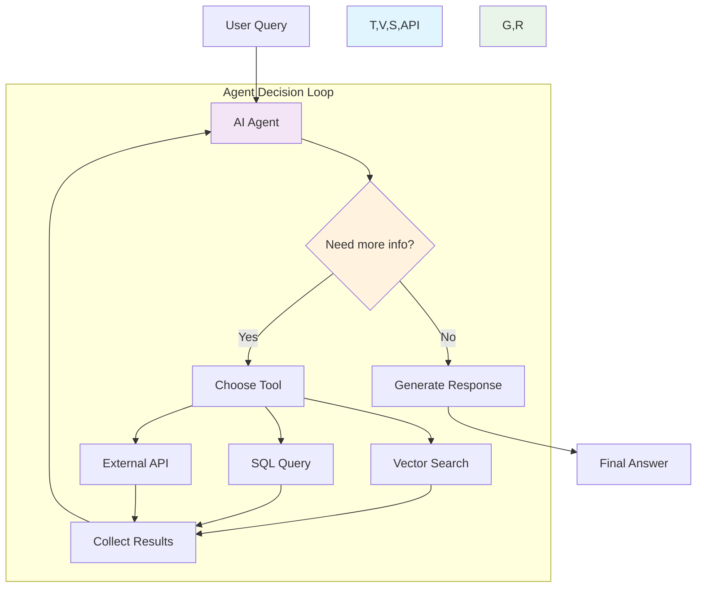

# Mermaid Diagram 29: 5. Agentic RAG

```mermaid
flowchart TD
    Q[User Query] --> A[AI Agent]
    
    subgraph "Agent Decision Loop"
        A --> D{Need more info?}
        D -- Yes --> T[Choose Tool]
        T --> V[Vector Search]
        T --> S[SQL Query]
        T --> API[External API]
        V & S & API --> C[Collect Results]
        C --> A
        D -- No --> G[Generate Response]
    end
    
    G --> R[Final Answer]
    
    style A fill:#f3e5f5
    style D fill:#fff3e0
    style T,V,S,API fill:#e1f5fe
    style G,R fill:#e8f5e8
```
