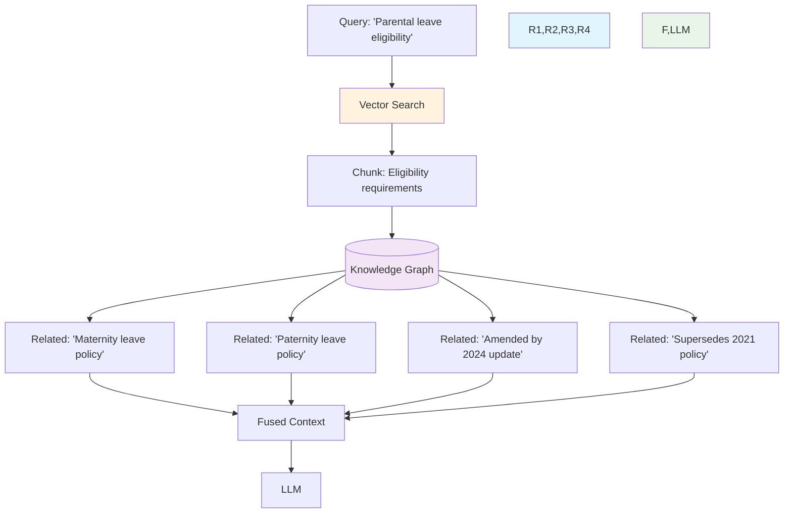

# Mermaid Diagram 30: Mermaid Diagram

```mermaid
graph TD
    Q[Query: 'Parental leave eligibility'] --> VS[Vector Search]
    VS --> C1[Chunk: Eligibility requirements]
    
    KG[(Knowledge Graph)]
    C1 --> KG
    KG --> R1[Related: 'Maternity leave policy']
    KG --> R2[Related: 'Paternity leave policy']
    KG --> R3[Related: 'Amended by 2024 update']
    KG --> R4[Related: 'Supersedes 2021 policy']
    
    R1 & R2 & R3 & R4 --> F[Fused Context]
    F --> LLM
    
    style VS fill:#fff3e0
    style KG fill:#f3e5f5
    style R1,R2,R3,R4 fill:#e1f5fe
    style F,LLM fill:#e8f5e8
```
