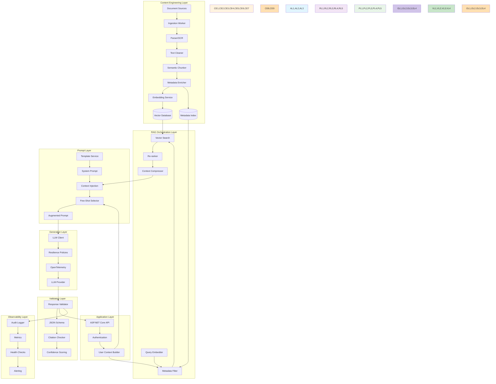

# Mermaid Diagram 33: Mermaid Diagram

```mermaid
flowchart TD
    subgraph "Content Engineering Layer"
        direction TB
        CE1[Document Sources] --> CE2[Ingestion Worker]
        CE2 --> CE3[Parser/OCR]
        CE3 --> CE4[Text Cleaner]
        CE4 --> CE5[Semantic Chunker]
        CE5 --> CE6[Metadata Enricher]
        CE6 --> CE7[Embedding Service]
        CE7 --> CE8[(Vector Database)]
        
        CE6 --> CE9[(Metadata Index)]
    end

    subgraph "Application Layer"
        direction TB
        AL1[ASP.NET Core API] --> AL2[Authentication]
        AL2 --> AL3[User Context Builder]
    end

    subgraph "RAG Orchestration Layer"
        direction TB
        RL1[Query Embedder] --> RL2[Metadata Filter]
        RL2 --> RL3[Vector Search]
        RL3 --> RL4[Re-ranker]
        RL4 --> RL5[Context Compressor]
    end

    subgraph "Prompt Layer"
        direction TB
        PL1[Template Service] --> PL2[System Prompt]
        PL2 --> PL3[Context Injection]
        PL3 --> PL4[Few-Shot Selector]
        PL4 --> PL5[Augmented Prompt]
    end

    subgraph "Generation Layer"
        direction TB
        GL1[LLM Client] --> GL2[Resilience Policies]
        GL2 --> GL3[OpenTelemetry]
        GL3 --> GL4[LLM Provider]
    end

    subgraph "Validation Layer"
        direction TB
        VL1[Response Validator] --> VL2[JSON Schema]
        VL2 --> VL3[Citation Checker]
        VL3 --> VL4[Confidence Scoring]
    end

    subgraph "Observability Layer"
        direction TB
        OL1[Audit Logger] --> OL2[Metrics]
        OL2 --> OL3[Health Checks]
        OL3 --> OL4[Alerting]
    end

    CE8 --> RL3
    CE9 --> RL2
    
    AL3 --> RL2
    AL3 --> PL4
    
    RL5 --> PL3
    PL5 --> GL1
    GL4 --> VL1
    
    VL1 --> AL1
    VL1 --> OL1
    
    style CE1,CE2,CE3,CE4,CE5,CE6,CE7 fill:#fff3e0
    style CE8,CE9 fill:#ffe0b2
    style AL1,AL2,AL3 fill:#e1f5fe
    style RL1,RL2,RL3,RL4,RL5 fill:#f3e5f5
    style PL1,PL2,PL3,PL4,PL5 fill:#e8f5e8
    style GL1,GL2,GL3,GL4 fill:#d1c4e9
    style VL1,VL2,VL3,VL4 fill:#c8e6c9
    style OL1,OL2,OL3,OL4 fill:#ffe0b2
```
