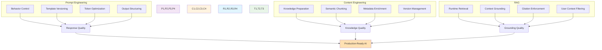

# Mermaid Diagram 34: 📊 Comparison Table: Three Pillars of Production AI

```mermaid
graph TD
    subgraph "Prompt Engineering"
        P1[Behavior Control]
        P2[Template Versioning]
        P3[Token Optimization]
        P4[Output Structuring]
    end
    
    subgraph "Content Engineering"
        C1[Knowledge Preparation]
        C2[Semantic Chunking]
        C3[Metadata Enrichment]
        C4[Version Management]
    end
    
    subgraph "RAG"
        R1[Runtime Retrieval]
        R2[Context Grounding]
        R3[Citation Enforcement]
        R4[User Context Filtering]
    end
    
    P1 & P2 & P3 & P4 --> T1[Response Quality]
    C1 & C2 & C3 & C4 --> T2[Knowledge Quality]
    R1 & R2 & R3 & R4 --> T3[Grounding Quality]
    
    T1 & T2 & T3 --> PROD[Production-Ready AI]
    
    style P1,P2,P3,P4 fill:#f3e5f5
    style C1,C2,C3,C4 fill:#fff3e0
    style R1,R2,R3,R4 fill:#e1f5fe
    style T1,T2,T3 fill:#e8f5e8
    style PROD fill:#ffe0b2
```
