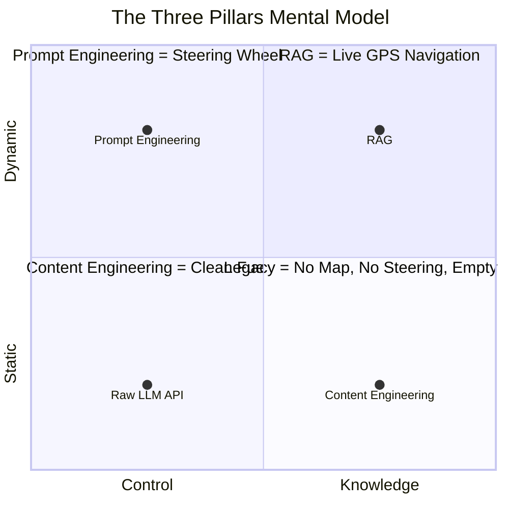

# Mermaid Diagram 35: Cost Driver

```mermaid
quadrantChart
    title The Three Pillars Mental Model
    x-axis "Control" --> "Knowledge"
    y-axis "Static" --> "Dynamic"
    quadrant-1 "RAG = Live GPS Navigation"
    quadrant-2 "Prompt Engineering = Steering Wheel"
    quadrant-3 "Content Engineering = Clean Fuel"
    quadrant-4 "Legacy = No Map, No Steering, Empty Tank"
    "RAG": [0.75, 0.8]
    "Prompt Engineering": [0.25, 0.8]
    "Content Engineering": [0.75, 0.2]
    "Raw LLM API": [0.25, 0.2]
```
