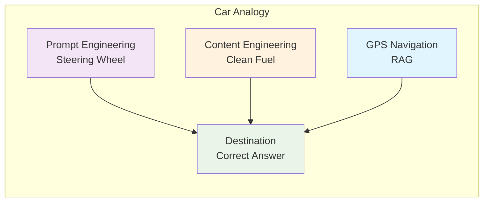

# Mermaid Diagram 36: Together:

```mermaid
graph LR
    subgraph "Car Analogy"
        PE[Prompt Engineering<br/>Steering Wheel] --> D[Destination<br/>Correct Answer]
        CE[Content Engineering<br/>Clean Fuel] --> D
        RAG[GPS Navigation<br/>RAG] --> D
    end
    
    style PE fill:#f3e5f5
    style CE fill:#fff3e0
    style RAG fill:#e1f5fe
    style D fill:#e8f5e8
```
