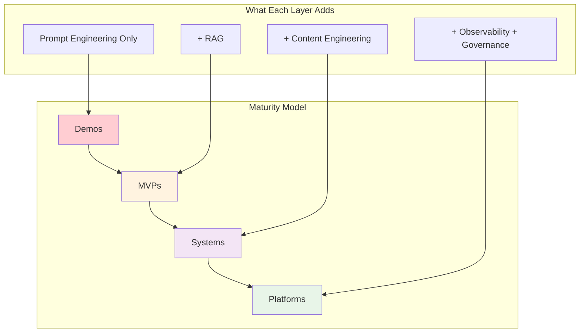

# Mermaid Diagram 37: 🏁 Conclusion: From Demos to Platforms

```mermaid
graph TD
    subgraph "Maturity Model"
        M1[Demos] --> M2[MVPs]
        M2 --> M3[Systems]
        M3 --> M4[Platforms]
    end
    
    subgraph "What Each Layer Adds"
        L1[Prompt Engineering Only] --> M1
        L2[+ RAG] --> M2
        L3[+ Content Engineering] --> M3
        L4[+ Observability + Governance] --> M4
    end
    
    style M1 fill:#ffcdd2
    style M2 fill:#fff3e0
    style M3 fill:#f3e5f5
    style M4 fill:#e8f5e8
```
