# Prompt Engineering vs Content Engineering vs RAG

## Document Information
- **File Name:** Prompt Engineering vs Content Engineering vs RAG.md
- **Total Words:** 7943
- **Estimated Reading Time:** 39 minutes

---


## Mermaid Diagram 1: 🧠 The Cognitive Architecture of Enterprise AI

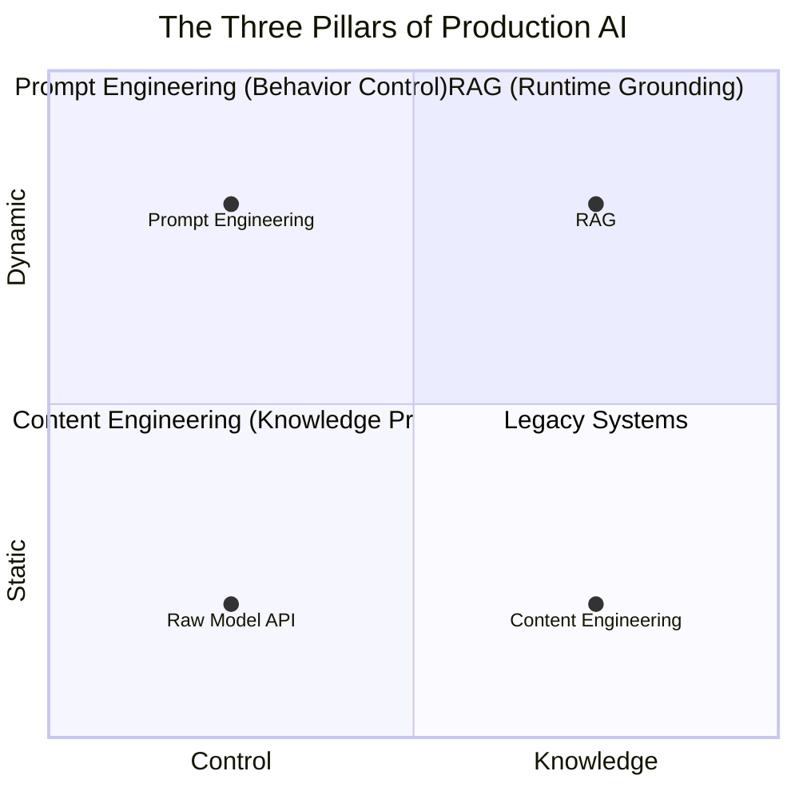


## Table 1: Untitled

| Layer | Solves | Analogy |
|-------|--------|---------|
| **Prompt Engineering** | How the model thinks | Behavioral steering wheel |
| **Content Engineering** | What the model knows | Knowledge refinery |
| **RAG** | What knowledge is used when | Live navigation system |


## Mermaid Diagram 2: 🎭 Deep Introduction: The Probability Shaper

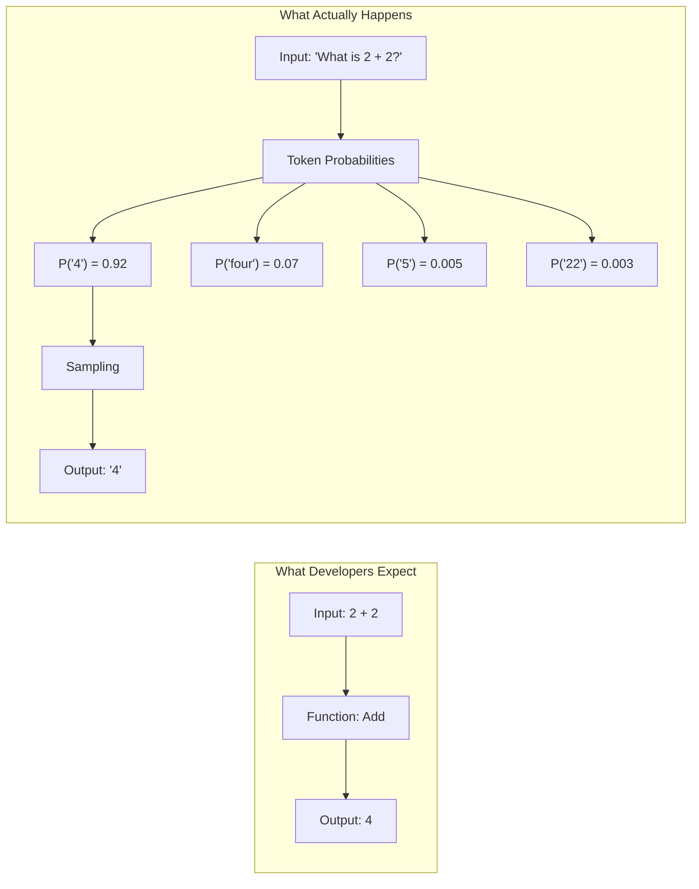


## Table 2: The same prompt, twice, can yield different results

| Dimension | Enterprise Impact |
|-----------|-------------------|
| **Reasoning depth** | Does the model think step-by-step or jump to conclusions? |
| **Tone** | Formal, empathetic, technical, executive-summary? |
| **Format** | JSON, markdown, plain text, tables? |
| **Output determinism** | Temperature, top-p, consistent vs. creative? |
| **Safety** | Refusing harmful or off-policy requests? |
| **Compliance behavior** | Citing sources, stating uncertainty, disclosing limitations? |
| **Cost efficiency** | Token optimization, response length control |


## Mermaid Diagram 3: In enterprise AI, prompt engineering is about *contracts*.

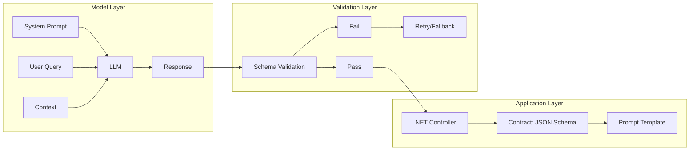


## Mermaid Diagram 4: 📚 Types of Prompting: From Zero to Complex

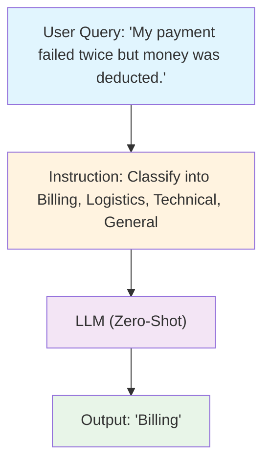


## Mermaid Diagram 5: ❌ Limitations:

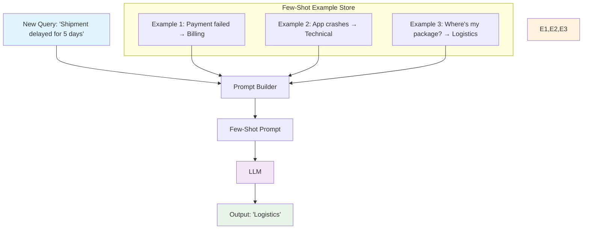


## Mermaid Diagram 6: Model Output:

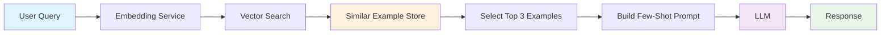


## Mermaid Diagram 7: prompt-time retrieval

```mermaid
flowchart TD
    subgraph "Standard Prompting"
        Q[Question] --> A[Direct Answer]
        A -.-> E1[Potential Error: Surface pattern match]
    end
    
    subgraph "Chain-of-Thought"
        Q2[Question] --> S1[Step 1: Check income]
        S1 --> S2[Step 2: Check debt ratio]
        S2 --> S3[Step 3: Check credit score]
        S3 --> S4[Step 4: Evaluate]
        S4 --> R[Reasoned Answer]
        R --> E2[Error: Reduced]
    end
    
    style Q fill:#e1f5fe
    style Q2 fill:#e1f5fe
    style S1,S2,S3,S4 fill:#fff3e0
    style R fill:#e8f5e8
```


## Mermaid Diagram 8: The Cognitive Science:

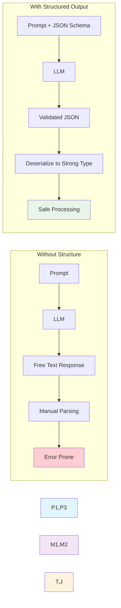


## Table 3: ⚙️ Advanced Prompt Techniques

| Technique | Purpose | Implementation |
|-----------|---------|----------------|
| **Response length constraints** | Cost control, conciseness | `MaxTokens: 100`, "Respond in exactly 3 sentences" |
| **Refusal enforcement** | Safety, compliance | "If the request violates policy, respond ONLY with: 'I cannot assist with this request.'" |
| **Citation requirements** | Traceability, verification | "For each statement, cite the policy section in brackets [Section X.Y]" |
| **Context usage enforcement** | Hallucination prevention | "If the answer is not found in the context provided, respond: 'I do not have sufficient information to answer this question.'" |
| **Tool invocation** | Agent capabilities | "When you need to check real-time data, respond with: TOOL_CALL: get_weather[city_name]" |
| **Multi-language constraints** | Global deployment | "Respond in the same language as the user's question" |


## Mermaid Diagram 9: Refusal enforcement

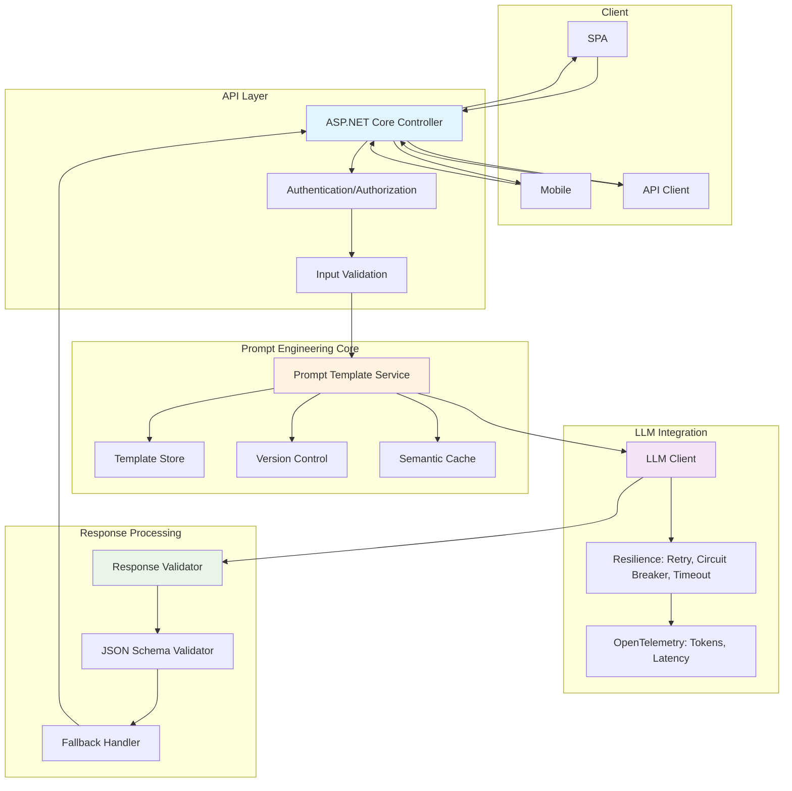


## Mermaid Diagram 10: A/B testing infrastructure

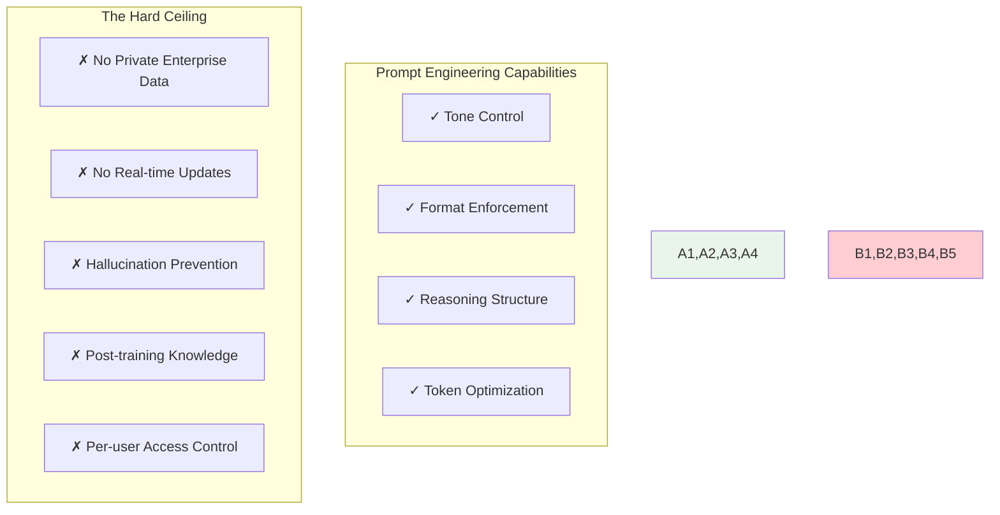


## Table 4: Untitled

| Limitation | Why It Matters |
|-----------|----------------|
| **Cannot access private enterprise data** | Your HR policies aren't in GPT-4's training data. Never will be. |
| **Cannot update knowledge** | New regulations passed this morning? Model doesn't know. |
| **Cannot prevent hallucination fully** | Even with "say you don't know," models sometimes lie confidently. |
| **Cannot resolve outdated training information** | The cutoff date is immovable. |
| **Cannot enforce per-user access controls** | All users see the same model knowledge. |


## Mermaid Diagram 11: 🏗️ Deep Introduction: Knowledge Architecture for Machine Reasoning

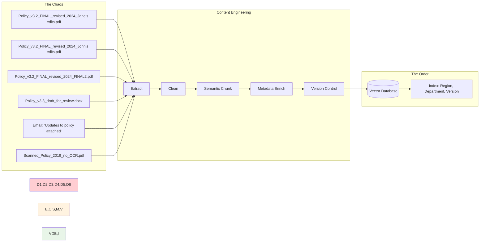


## Mermaid Diagram 12: 💀 The Hidden Complexity: Why Enterprise Content Engineering Fails

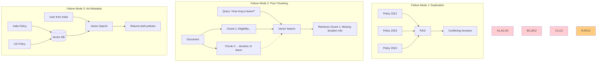


## Table 5: Common Failure Modes:

| Problem | Manifestation | Root Cause |
|---------|---------------|------------|
| **Duplicate documents** | RAG returns three slightly different versions of same policy | No canonical source identification |
| **Outdated policies** | AI cites 2021 regulation, 2024 amendment exists | No version tracking |
| **Inconsistent formats** | Some documents chunk well, others fragment | No standardized ingestion |
| **Poor chunking** | Retrieved text cuts off mid-sentence, mid-thought | Naive character splitting |
| **Missing metadata** | Indian employee receives US benefits information | No region tags |
| **Scanned PDFs** | OCR garbage → embedding garbage → retrieval garbage | No OCR quality validation |
| **Conflicting terminology** | "Parental leave" in one doc, "Family leave" in another | No ontology alignment |


## Mermaid Diagram 13: Inconsistent formats

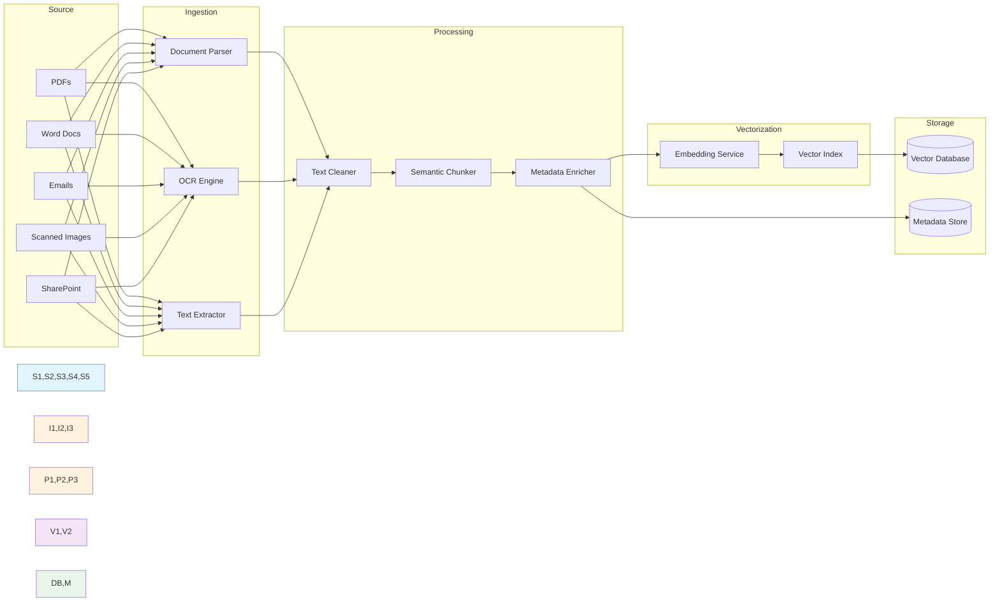


## Mermaid Diagram 14: 📄 Chunking Strategy: The Critical Detail

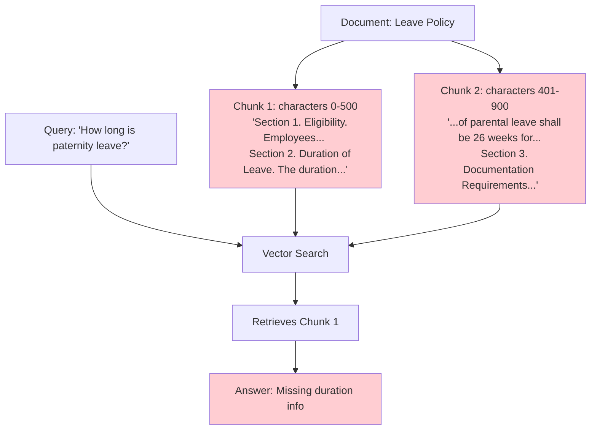


## Mermaid Diagram 15: Good Chunking (Semantic):

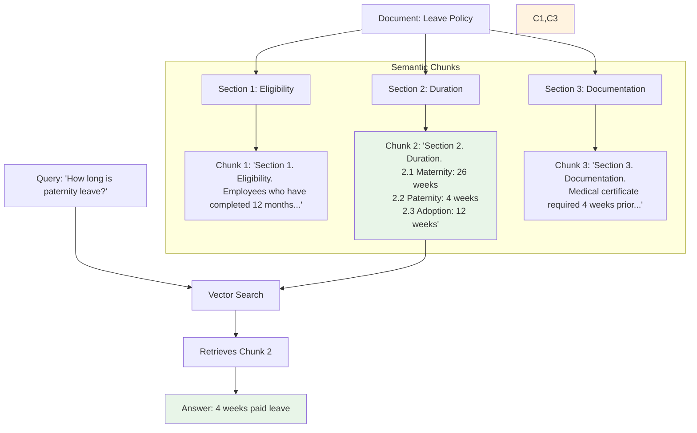


## Mermaid Diagram 16: Overlap Strategy:

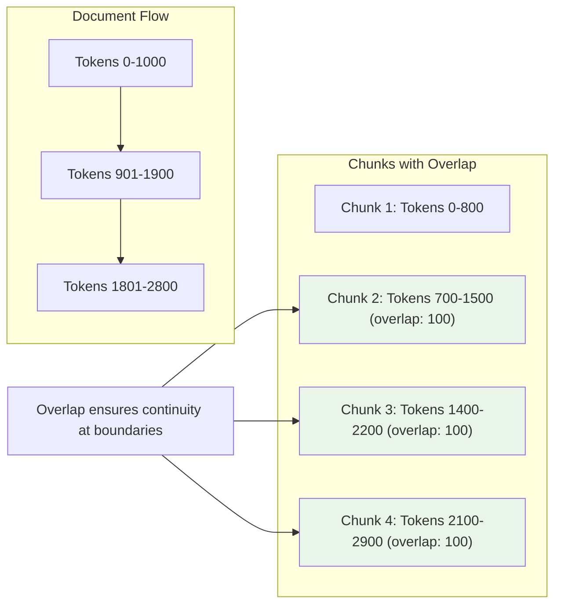


## Mermaid Diagram 17: 🏷️ Metadata Strategy: The Knowledge Labeling System

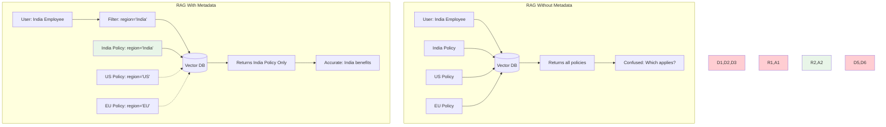


## Table 6: What metadata enables:

| Capability | Without Metadata | With Metadata |
|-----------|------------------|---------------|
| **Regional filtering** | Indian employee gets US policy | India tag → India policy only |
| **Version control** | 2019 policy cited as current | Version 3.1 filtered, old versions excluded |
| **Access control** | Everyone sees everything | Confidentiality + user role filtering |
| **Recency bias** | Old and new equally retrievable | Effective date boosts recent policies |
| **Department scoping** | HR bot answers engineering questions | Department filter restricts domain |


## Mermaid Diagram 18: Department scoping

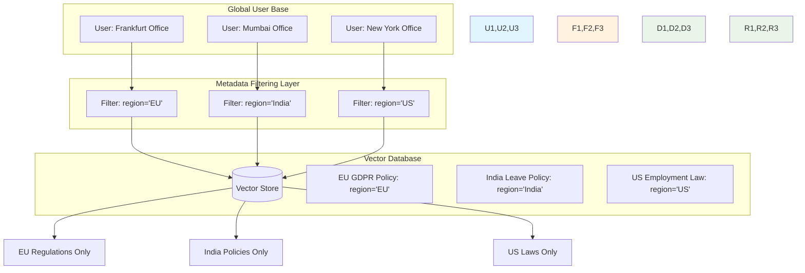


## Mermaid Diagram 19: Result:

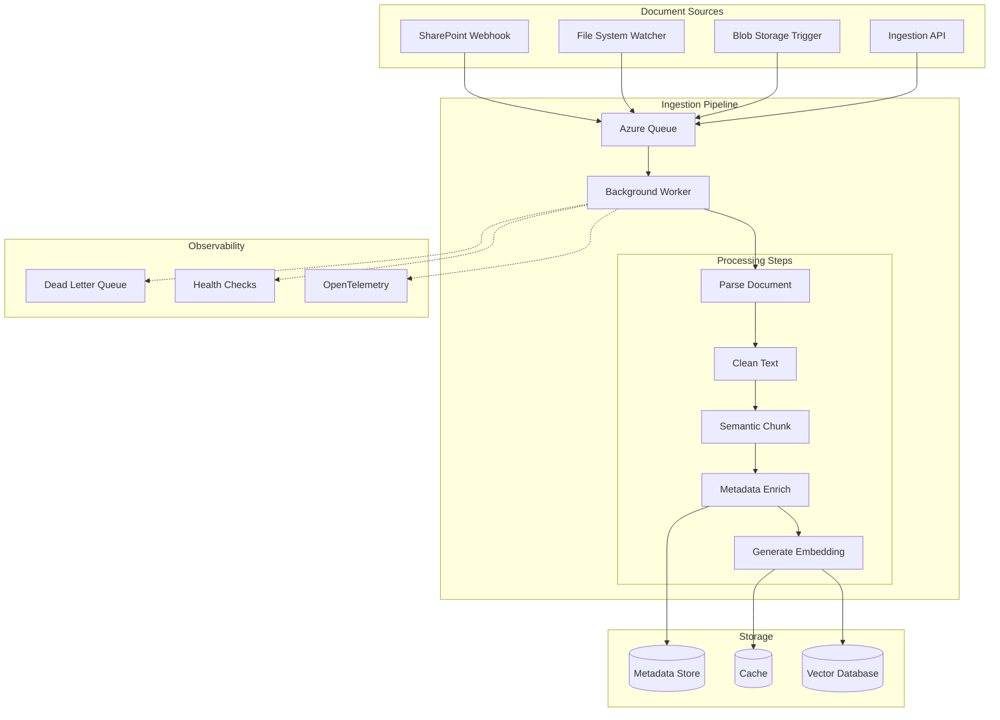


## Table 7: Key Technologies:

| Component | Options |
|-----------|---------|
| **PDF Extraction** | iText7, PdfPig, Azure AI Document Intelligence |
| **Office Documents** | OpenXML SDK, NPOI, Aspose |
| **OCR** | Tesseract, Azure Computer Vision, AWS Textract |
| **Embedding** | Azure OpenAI, Semantic Kernel, Ollama, SentenceTransformers |
| **Vector Storage** | PostgreSQL + pgvector, Azure AI Search, Qdrant, Pinecone |
| **Orchestration** | Azure Functions, Durable Functions, Kubernetes Jobs |


## Mermaid Diagram 20: 🔮 The Output: Deterministic Knowledge

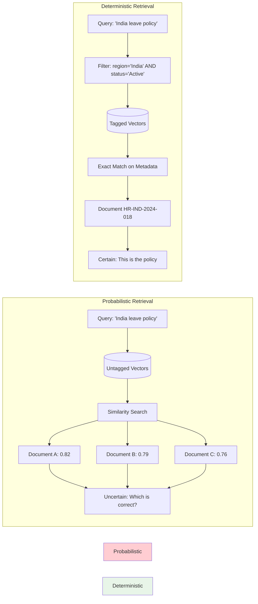


## Mermaid Diagram 21: *Connecting Models to Live Enterprise Knowledge*

```mermaid
timeline
    title The Knowledge Gap
    section Model Training
        Training Date : Model learns data up to cutoff
    section Post-Cutoff Events
        Day After Cutoff : New regulations passed
        Last Week : Company policy updated
        Yesterday : Compliance memo distributed
        Today : User asks question
        Now : Model doesn't know
```


## Mermaid Diagram 22: RAG solves this by:

```mermaid
flowchart TD
    subgraph "Without RAG"
        Q1[User Question] --> M1[LLM Static Knowledge]
        M1 --> A1[Answer based on training data]
        A1 --> P1[May be outdated]
        A1 --> P2[No citations]
        A1 --> P3[No enterprise-specific info]
    end
    
    subgraph "With RAG"
        Q2[User Question] --> R[Retrieval System]
        KB[(Enterprise Knowledge Base)] --> R
        R --> C[Retrieved Context]
        C --> M2[LLM]
        Q2 --> M2
        M2 --> A2[Answer grounded in context]
        A2 --> P4[Current knowledge]
        A2 --> P5[Verifiable citations]
        A2 --> P6[Enterprise-specific]
    end
    
    style Without RAG fill:#ffcdd2
    style With RAG fill:#e8f5e8
```


## Mermaid Diagram 23: 🔄 The RAG Pipeline: Step by Step

```mermaid
flowchart TD
    subgraph "Query Time"
        A[User Query] --> B[Embed Query]
        B --> C[Vector Search]
        D[(Vector Database)] --> C
        C --> E[Metadata Filtering]
        F[User Context] --> E
    end
    
    subgraph "Augmentation"
        E --> G[Retrieved Chunks Top-K]
        G --> H[Prompt Builder]
        I[System Prompt Template] --> H
        H --> J[Augmented Prompt]
    end
    
    subgraph "Generation"
        J --> K[LLM]
        K --> L[Grounded Response]
        L --> M[Citation Validation]
    end
    
    subgraph "Observability"
        M --> N[Log Sources]
        N --> O[Audit Trail]
        N --> P[Feedback Loop]
    end
    
    style A fill:#e1f5fe
    style B,C,D,E fill:#fff3e0
    style G,H,I,J fill:#f3e5f5
    style K,L,M fill:#e8f5e8
    style N,O,P fill:#ffe0b2
```


## Mermaid Diagram 24: Step 6: Validation & Observability

```mermaid
sequenceDiagram
    participant User
    participant API as .NET API
    participant Vector as Vector DB
    participant Prompt as Prompt Service
    participant LLM
    participant Audit as Audit Log
    
    User->>API: "What is maternity leave in India?"
    
    API->>API: Get user context (region=India)
    API->>Vector: Embed query + filter region='India'
    
    Vector-->>API: Return top 3 relevant chunks
    Note right of Vector: • 26 weeks paid leave<br/>• Eligibility: 12 months<br/>• Documentation required
    
    API->>Prompt: Build prompt with context
    Prompt-->>API: Augmented prompt
    
    API->>LLM: Generate grounded response
    LLM-->>API: "26 weeks paid leave..." with citations
    
    API->>API: Validate citations exist in chunks
    API->>Audit: Log query, sources, response
    
    API-->>User: Grounded answer + sources
```


## Mermaid Diagram 25: Grounded. Verifiable. Auditable.

```mermaid
flowchart LR
    Q[Query] --> VE[Vector Embedding]
    Q --> KE[Keyword Extraction]
    
    subgraph "Vector Search"
        VE --> VS[(Vector Index)]
        VS --> VR[Vector Results]
    end
    
    subgraph "Keyword Search"
        KE --> KS[(BM25 Index)]
        KS --> KR[Keyword Results]
    end
    
    subgraph "Reciprocal Rank Fusion"
        VR --> RRF
        KR --> RRF
        RRF --> F[Fused Rankings]
        F --> T[Top K Results]
    end
    
    style VE,VS,VR fill:#f3e5f5
    style KE,KS,KR fill:#fff3e0
    style RRF,F,T fill:#e8f5e8
```


## Mermaid Diagram 26: 2. Re-ranking

```mermaid
flowchart LR
    Q[Query] --> VS[(Vector Index)]
    VS --> C50[Top 50 Candidates]
    C50 --> RR[Cross-Encoder Re-ranker]
    Q --> RR
    RR --> C10[Top 10 Re-ranked]
    C10 --> LLM
    
    style VS fill:#fff3e0
    style RR fill:#f3e5f5
    style C10 fill:#e8f5e8
```


## Mermaid Diagram 27: 3. Multi-Hop Retrieval

```mermaid
flowchart TD
    Q[User: Which EU countries have stricter privacy laws than our standard policy?]
    
    subgraph "Hop 1"
        R1[Retrieve: Our standard privacy policy]
        C1[Context: Standard policy requirements]
    end
    
    subgraph "Hop 2"
        R2[Retrieve: GDPR requirements]
        C2[Context: EU baseline regulations]
    end
    
    subgraph "Hop 3"
        R3[Retrieve: Individual EU country laws]
        C3[Context: France, Germany, Netherlands specifics]
    end
    
    subgraph "Reasoning"
        Compare[Compare each country vs. standard]
        Filter[Identify stricter jurisdictions]
    end
    
    Q --> R1 --> C1 --> R2 --> C2 --> R3 --> C3 --> Compare --> Filter
    
    style R1,R2,R3 fill:#fff3e0
    style C1,C2,C3 fill:#f3e5f5
    style Compare,Filter fill:#e8f5e8
```


## Mermaid Diagram 28: 4. Context Compression

```mermaid
flowchart LR
    RC[Raw Chunk: 500 tokens] --> EX[Extractor LLM]
    Q[Query] --> EX
    EX --> CC[Compressed Context: 150 tokens]
    CC --> A[Augmented Prompt]
    
    style RC fill:#ffcdd2
    style EX fill:#f3e5f5
    style CC fill:#e8f5e8
```


## Mermaid Diagram 29: 5. Agentic RAG

```mermaid
flowchart TD
    Q[User Query] --> A[AI Agent]
    
    subgraph "Agent Decision Loop"
        A --> D{Need more info?}
        D -- Yes --> T[Choose Tool]
        T --> V[Vector Search]
        T --> S[SQL Query]
        T --> API[External API]
        V & S & API --> C[Collect Results]
        C --> A
        D -- No --> G[Generate Response]
    end
    
    G --> R[Final Answer]
    
    style A fill:#f3e5f5
    style D fill:#fff3e0
    style T,V,S,API fill:#e1f5fe
    style G,R fill:#e8f5e8
```


## Mermaid Diagram 30: 6. Knowledge Graph RAG

```mermaid
graph TD
    Q[Query: 'Parental leave eligibility'] --> VS[Vector Search]
    VS --> C1[Chunk: Eligibility requirements]
    
    KG[(Knowledge Graph)]
    C1 --> KG
    KG --> R1[Related: 'Maternity leave policy']
    KG --> R2[Related: 'Paternity leave policy']
    KG --> R3[Related: 'Amended by 2024 update']
    KG --> R4[Related: 'Supersedes 2021 policy']
    
    R1 & R2 & R3 & R4 --> F[Fused Context]
    F --> LLM
    
    style VS fill:#fff3e0
    style KG fill:#f3e5f5
    style R1,R2,R3,R4 fill:#e1f5fe
    style F,LLM fill:#e8f5e8
```


## Mermaid Diagram 31: 🏛️ RAG in .NET 9/10 Enterprise Architecture

```mermaid
flowchart TD
    subgraph "Request Flow"
        REQ[HTTP Request] --> AUTH[Authenticate]
        AUTH --> CTX[Build User Context]
        CTX --> EMB[Embed Query]
        EMB --> FILT[Apply Metadata Filters]
        FILT --> VS[(Vector Search)]
        VS --> RANK[Re-rank]
    end
    
    subgraph "Context Building"
        CTX --> REGION[Region: India]
        CTX --> ROLE[Role: Employee]
        CTX --> DEPT[Dept: HR]
    end
    
    subgraph "Response Generation"
        RANK --> PROMPT[Build Prompt]
        PROMPT --> LLM[LLM Call]
        LLM --> VALID[Validate Citations]
        VALID --> AUDIT[Audit Log]
        AUDIT --> RESP[JSON Response]
    end
    
    style REQ fill:#e1f5fe
    style CTX,EMB,FILT fill:#fff3e0
    style PROMPT,LLM fill:#f3e5f5
    style VALID,AUDIT,RESP fill:#e8f5e8
```


## Mermaid Diagram 32: 🌍 Real Enterprise Scenario: Banking AI Platform

```mermaid
flowchart TD
    subgraph "The Challenge"
        C1[500+ Regulatory Documents]
        C2[15 Countries]
        C3[Daily Updates]
        C4[Role-based Access]
        C5[Audit Requirements]
        C6[Zero Hallucination Tolerance]
    end

    subgraph "Without Engineering"
        F1[✗ Duplicate documents]
        F2[✗ Conflicting versions]
        F3[✗ Region mixing]
        F4[✗ No traceability]
        F5[✗ Regulatory fines]
    end

    subgraph "With Three Pillars"
        S1[✓ Content Engineering]
        S2[✓ RAG Layer]
        S3[✓ Prompt Engineering]
        S4[✓ Observability]
    end

    subgraph "The Result"
        R1[100% Traceable]
        R2[Region Accurate]
        R3[Always Current]
        R4[Audit Ready]
        R5[Compliant AI]
    end

    C1 & C2 & C3 & C4 & C5 & C6 --> Without Engineering
    Without Engineering --> F1 & F2 & F3 & F4 & F5
    
    C1 & C2 & C3 & C4 & C5 & C6 --> With Three Pillars
    With Three Pillars --> S1 & S2 & S3 & S4
    S1 & S2 & S3 & S4 --> R1 & R2 & R3 & R4 & R5
    
    style Without Engineering fill:#ffcdd2
    style F1,F2,F3,F4,F5 fill:#ffcdd2
    style With Three Pillars fill:#e8f5e8
    style R1,R2,R3,R4,R5 fill:#e8f5e8
```


## Mermaid Diagram 33: Without Prompt Engineering:

```mermaid
flowchart TD
    subgraph "Content Engineering Layer"
        direction TB
        CE1[Document Sources] --> CE2[Ingestion Worker]
        CE2 --> CE3[Parser/OCR]
        CE3 --> CE4[Text Cleaner]
        CE4 --> CE5[Semantic Chunker]
        CE5 --> CE6[Metadata Enricher]
        CE6 --> CE7[Embedding Service]
        CE7 --> CE8[(Vector Database)]
        
        CE6 --> CE9[(Metadata Index)]
    end

    subgraph "Application Layer"
        direction TB
        AL1[ASP.NET Core API] --> AL2[Authentication]
        AL2 --> AL3[User Context Builder]
    end

    subgraph "RAG Orchestration Layer"
        direction TB
        RL1[Query Embedder] --> RL2[Metadata Filter]
        RL2 --> RL3[Vector Search]
        RL3 --> RL4[Re-ranker]
        RL4 --> RL5[Context Compressor]
    end

    subgraph "Prompt Layer"
        direction TB
        PL1[Template Service] --> PL2[System Prompt]
        PL2 --> PL3[Context Injection]
        PL3 --> PL4[Few-Shot Selector]
        PL4 --> PL5[Augmented Prompt]
    end

    subgraph "Generation Layer"
        direction TB
        GL1[LLM Client] --> GL2[Resilience Policies]
        GL2 --> GL3[OpenTelemetry]
        GL3 --> GL4[LLM Provider]
    end

    subgraph "Validation Layer"
        direction TB
        VL1[Response Validator] --> VL2[JSON Schema]
        VL2 --> VL3[Citation Checker]
        VL3 --> VL4[Confidence Scoring]
    end

    subgraph "Observability Layer"
        direction TB
        OL1[Audit Logger] --> OL2[Metrics]
        OL2 --> OL3[Health Checks]
        OL3 --> OL4[Alerting]
    end

    CE8 --> RL3
    CE9 --> RL2
    
    AL3 --> RL2
    AL3 --> PL4
    
    RL5 --> PL3
    PL5 --> GL1
    GL4 --> VL1
    
    VL1 --> AL1
    VL1 --> OL1
    
    style CE1,CE2,CE3,CE4,CE5,CE6,CE7 fill:#fff3e0
    style CE8,CE9 fill:#ffe0b2
    style AL1,AL2,AL3 fill:#e1f5fe
    style RL1,RL2,RL3,RL4,RL5 fill:#f3e5f5
    style PL1,PL2,PL3,PL4,PL5 fill:#e8f5e8
    style GL1,GL2,GL3,GL4 fill:#d1c4e9
    style VL1,VL2,VL3,VL4 fill:#c8e6c9
    style OL1,OL2,OL3,OL4 fill:#ffe0b2
```


## Mermaid Diagram 34: 📊 Comparison Table: Three Pillars of Production AI

```mermaid
graph TD
    subgraph "Prompt Engineering"
        P1[Behavior Control]
        P2[Template Versioning]
        P3[Token Optimization]
        P4[Output Structuring]
    end
    
    subgraph "Content Engineering"
        C1[Knowledge Preparation]
        C2[Semantic Chunking]
        C3[Metadata Enrichment]
        C4[Version Management]
    end
    
    subgraph "RAG"
        R1[Runtime Retrieval]
        R2[Context Grounding]
        R3[Citation Enforcement]
        R4[User Context Filtering]
    end
    
    P1 & P2 & P3 & P4 --> T1[Response Quality]
    C1 & C2 & C3 & C4 --> T2[Knowledge Quality]
    R1 & R2 & R3 & R4 --> T3[Grounding Quality]
    
    T1 & T2 & T3 --> PROD[Production-Ready AI]
    
    style P1,P2,P3,P4 fill:#f3e5f5
    style C1,C2,C3,C4 fill:#fff3e0
    style R1,R2,R3,R4 fill:#e1f5fe
    style T1,T2,T3 fill:#e8f5e8
    style PROD fill:#ffe0b2
```


## Table 8: Untitled

| Aspect | Prompt Engineering | Content Engineering | RAG |
|--------|-------------------|---------------------|-----|
| **Core Question** | How should the model behave? | What knowledge exists? | What knowledge is used now? |
| **Primary Artifact** | Prompt templates, system messages | Chunks, embeddings, metadata | Retrieval pipeline, augmented prompts |
| **Source of Truth** | Model's training + instructions | Enterprise documents | Retrieved context at query time |
| **Update Frequency** | Per prompt version | Continuous ingestion | Per query |
| **Failure Mode** | Inconsistent behavior, refusal | Garbage in, garbage out | Missing context, irrelevant retrieval |
| **Cost Driver** | Input + output tokens | Embedding generation + storage | Retrieval + augmented generation |
| **Observability** | Response quality, token usage | Document coverage, chunk quality | Retrieval relevance, citation accuracy |
| **.NET Implementation** | TemplateService, LLMClient | BackgroundService, VectorStore | RAGOrchestrator, MetadataFilter |
| **Dependency** | Model capability | Document quality | Vector search quality |
| **Maturity Level** | Demo → MVP | MVP → System | System → Platform |


## Mermaid Diagram 35: Cost Driver

```mermaid
quadrantChart
    title The Three Pillars Mental Model
    x-axis "Control" --> "Knowledge"
    y-axis "Static" --> "Dynamic"
    quadrant-1 "RAG = Live GPS Navigation"
    quadrant-2 "Prompt Engineering = Steering Wheel"
    quadrant-3 "Content Engineering = Clean Fuel"
    quadrant-4 "Legacy = No Map, No Steering, Empty Tank"
    "RAG": [0.75, 0.8]
    "Prompt Engineering": [0.25, 0.8]
    "Content Engineering": [0.75, 0.2]
    "Raw LLM API": [0.25, 0.2]
```


## Mermaid Diagram 36: Together:

```mermaid
graph LR
    subgraph "Car Analogy"
        PE[Prompt Engineering<br/>Steering Wheel] --> D[Destination<br/>Correct Answer]
        CE[Content Engineering<br/>Clean Fuel] --> D
        RAG[GPS Navigation<br/>RAG] --> D
    end
    
    style PE fill:#f3e5f5
    style CE fill:#fff3e0
    style RAG fill:#e1f5fe
    style D fill:#e8f5e8
```


## Mermaid Diagram 37: 🏁 Conclusion: From Demos to Platforms

```mermaid
graph TD
    subgraph "Maturity Model"
        M1[Demos] --> M2[MVPs]
        M2 --> M3[Systems]
        M3 --> M4[Platforms]
    end
    
    subgraph "What Each Layer Adds"
        L1[Prompt Engineering Only] --> M1
        L2[+ RAG] --> M2
        L3[+ Content Engineering] --> M3
        L4[+ Observability + Governance] --> M4
    end
    
    style M1 fill:#ffcdd2
    style M2 fill:#fff3e0
    style M3 fill:#f3e5f5
    style M4 fill:#e8f5e8
```


## Mermaid Diagram 38: Add RAG → you get a system.

```mermaid
graph LR
    subgraph "Investment"
        I1[Prompt Engineering: Low]
        I2[Content Engineering: Medium]
        I3[RAG: Medium-High]
    end
    
    subgraph "Return"
        R1[Accuracy: High]
        R2[Maintainability: High]
        R3[Auditability: Complete]
        R4[Scalability: Enterprise]
        R5[Cost Efficiency: Optimized]
    end
    
    I1 & I2 & I3 --> R1 & R2 & R3 & R4 & R5
    
    style I1,I2,I3 fill:#fff3e0
    style R1,R2,R3,R4,R5 fill:#e8f5e8
```


---
*This story was automatically generated from Prompt Engineering vs Content Engineering vs RAG.md on 2026-03-01 14:26:26.*