# Prompt Engineering vs Content Engineering vs RAG
**Stats:** 7958 words | Estimated Reading Time: 40 min


---

### Asset: 01-stop-at-newline-return-okrespo.md
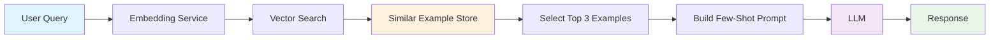

### Asset: 02-b-testing-infrastructure-for-p.md
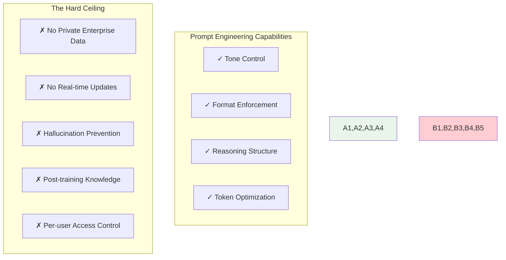

### Asset: 03-cannot-access-private-enterpri.md
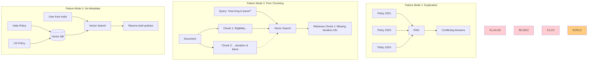

### Asset: 04-common-failure-modes-problem-m.md
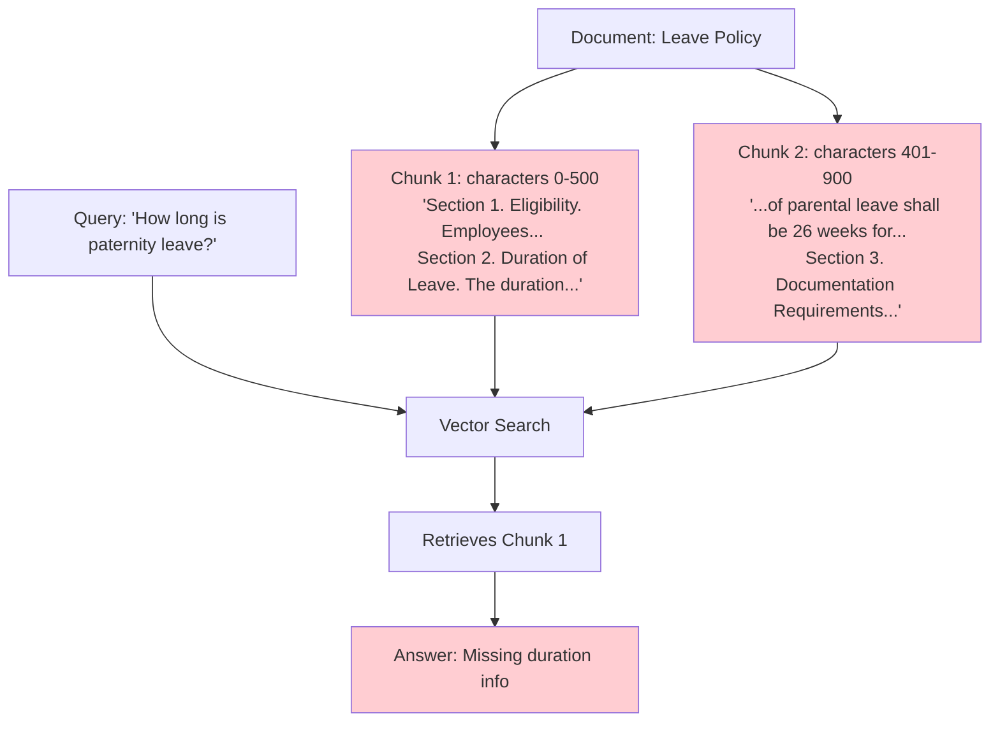

### Asset: 05-good-chunking-semantic.md
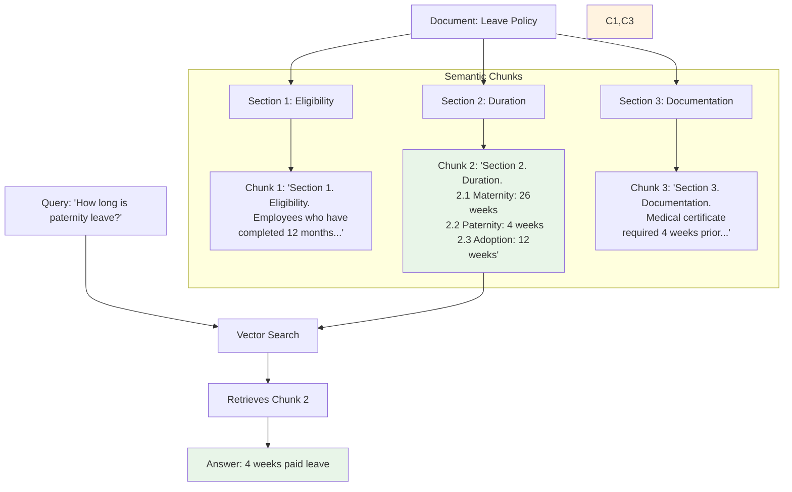

### Asset: 06-10-ingestion-worker-architectu.md
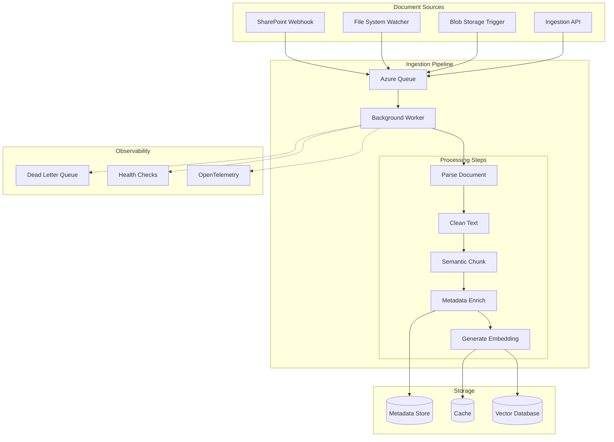

### Asset: 07-6-store-in-vector-database-awa.md
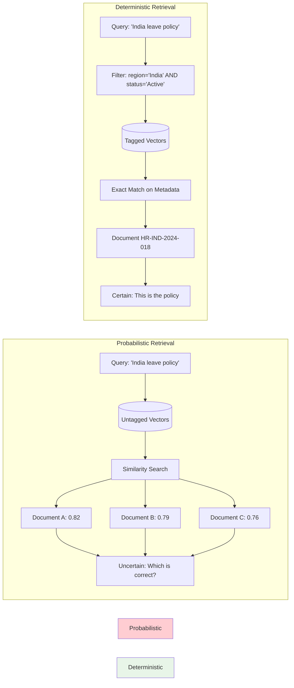

### Asset: 08-this-is-the-difference-between.md
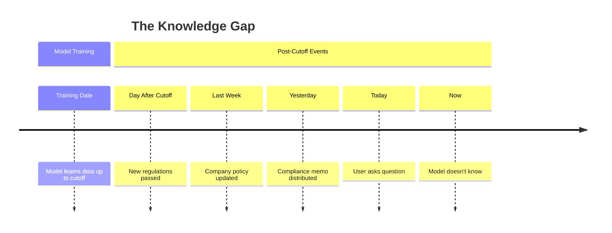

### Asset: 09-10-enterprise-architecture-rag.md
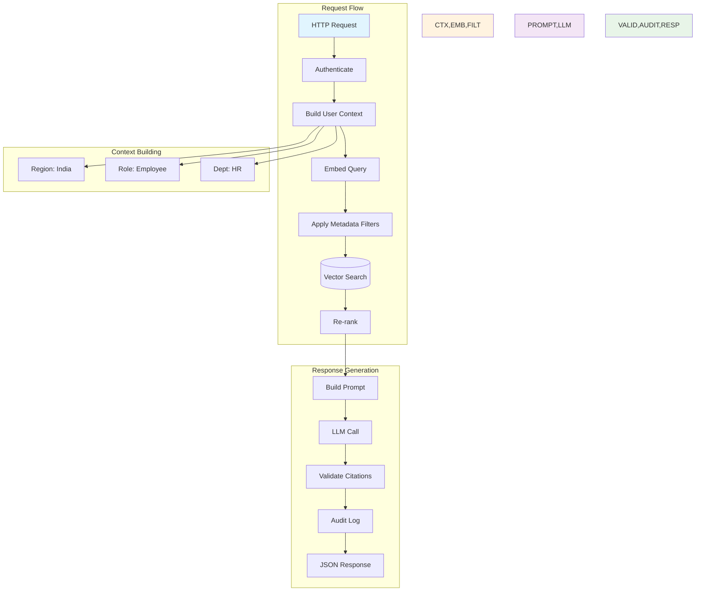

### Asset: 10-diag-10.md
```mermaid
flowchart TD
    subgraph "The Challenge"
        C1[500+ Regulatory Documents]
        C2[15 Countries]
        C3[Daily Updates]
        C4[Role-based Access]
        C5[Audit Requirements]
        C6[Zero Hallucination Tolerance]
    end

    subgraph "Without Engineering"
        F1[✗ Duplicate documents]
        F2[✗ Conflicting versions]
        F3[✗ Region mixing]
        F4[✗ No traceability]
        F5[✗ Regulatory fines]
    end

    subgraph "With Three Pillars"
        S1[✓ Content Engineering]
        S2[✓ RAG Layer]
        S3[✓ Prompt Engineering]
        S4[✓ Observability]
    end

    subgraph "The Result"
        R1[100% Traceable]
        R2[Region Accurate]
        R3[Always Current]
        R4[Audit Ready]
        R5[Compliant AI]
    end

    C1 & C2 & C3 & C4 & C5 & C6 --> Without Engineering
    Without Engineering --> F1 & F2 & F3 & F4 & F5
    
    C1 & C2 & C3 & C4 & C5 & C6 --> With Three Pillars
    With Three Pillars --> S1 & S2 & S3 & S4
    S1 & S2 & S3 & S4 --> R1 & R2 & R3 & R4 & R5
    
    style Without Engineering fill:#ffcdd2
    style F1,F2,F3,F4,F5 fill:#ffcdd2
    style With Three Pillars fill:#e8f5e8
    style R1,R2,R3,R4,R5 fill:#e8f5e8
```

### Asset: 11-ocr-ce3-ce4text-cleaner-ce4-ce.md
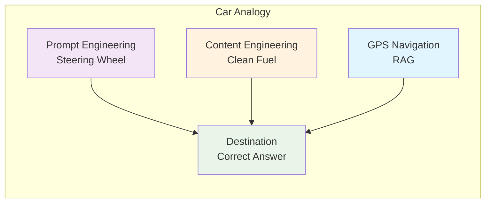

### Asset: 12-enterprise-ai-requires-all-thr.md
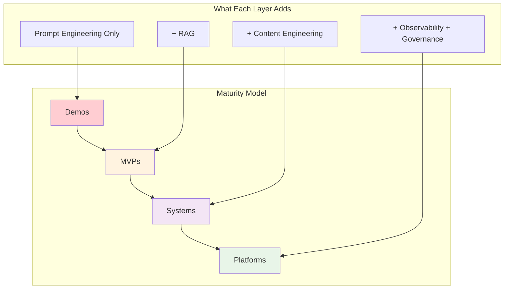

### Asset: 13-diag-13.md
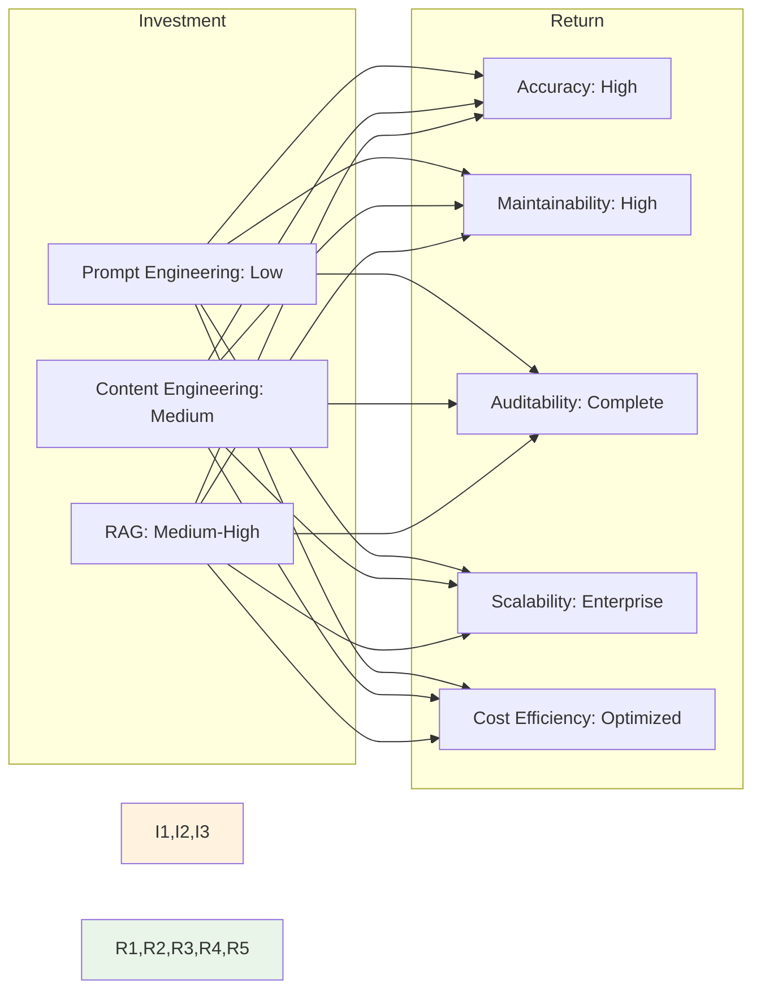

### Asset: 14-tbl-14.md
| Layer | Solves | Analogy |
|-------|--------|---------|
| **Prompt Engineering** | How the model thinks | Behavioral steering wheel |
| **Content Engineering** | What the model knows | Knowledge refinery |
| **RAG** | What knowledge is used when | Live navigation system |

****

### Asset: 15-tbl-15.md
| Dimension | Enterprise Impact |
|-----------|-------------------|
| **Reasoning depth** | Does the model think step-by-step or jump to conclusions? |
| **Tone** | Formal, empathetic, technical, executive-summary? |
| **Format** | JSON, markdown, plain text, tables? |
| **Output determinism** | Temperature, top-p, consistent vs. creative? |
| **Safety** | Refusing harmful or off-policy requests? |
| **Compliance behavior** | Citing sources, stating uncertainty, disclosing limitations? |
| **Cost efficiency** | Token optimization, response length control |

****

### Asset: 16-tbl-16.md
| Technique | Purpose | Implementation |
|-----------|---------|----------------|
| **Response length constraints** | Cost control, conciseness | `MaxTokens: 100`, "Respond in exactly 3 sentences" |
| **Refusal enforcement** | Safety, compliance | "If the request violates policy, respond ONLY with: 'I cannot assist with this request.'" |
| **Citation requirements** | Traceability, verification | "For each statement, cite the policy section in brackets [Section X.Y]" |
| **Context usage enforcement** | Hallucination prevention | "If the answer is not found in the context provided, respond: 'I do not have sufficient information to answer this question.'" |
| **Tool invocation** | Agent capabilities | "When you need to check real-time data, respond with: TOOL_CALL: get_weather[city_name]" |
| **Multi-language constraints** | Global deployment | "Respond in the same language as the user's question" |

****

### Asset: 17-tbl-17.md
| Limitation | Why It Matters |
|-----------|----------------|
| **Cannot access private enterprise data** | Your HR policies aren't in GPT-4's training data. Never will be. |
| **Cannot update knowledge** | New regulations passed this morning? Model doesn't know. |
| **Cannot prevent hallucination fully** | Even with "say you don't know," models sometimes lie confidently. |
| **Cannot resolve outdated training information** | The cutoff date is immovable. |
| **Cannot enforce per-user access controls** | All users see the same model knowledge. |

****

### Asset: 18-common-failure-modes.md
| Problem | Manifestation | Root Cause |
|---------|---------------|------------|
| **Duplicate documents** | RAG returns three slightly different versions of same policy | No canonical source identification |
| **Outdated policies** | AI cites 2021 regulation, 2024 amendment exists | No version tracking |
| **Inconsistent formats** | Some documents chunk well, others fragment | No standardized ingestion |
| **Poor chunking** | Retrieved text cuts off mid-sentence, mid-thought | Naive character splitting |
| **Missing metadata** | Indian employee receives US benefits information | No region tags |
| **Scanned PDFs** | OCR garbage → embedding garbage → retrieval garbage | No OCR quality validation |
| **Conflicting terminology** | "Parental leave" in one doc, "Family leave" in another | No ontology alignment |

**Common Failure Modes:**

### Asset: 19-what-metadata-enables.md
| Capability | Without Metadata | With Metadata |
|-----------|------------------|---------------|
| **Regional filtering** | Indian employee gets US policy | India tag → India policy only |
| **Version control** | 2019 policy cited as current | Version 3.1 filtered, old versions excluded |
| **Access control** | Everyone sees everything | Confidentiality + user role filtering |
| **Recency bias** | Old and new equally retrievable | Effective date boosts recent policies |
| **Department scoping** | HR bot answers engineering questions | Department filter restricts domain |

**What metadata enables:**

### Asset: 20-key-technologies.md
| Component | Options |
|-----------|---------|
| **PDF Extraction** | iText7, PdfPig, Azure AI Document Intelligence |
| **Office Documents** | OpenXML SDK, NPOI, Aspose |
| **OCR** | Tesseract, Azure Computer Vision, AWS Textract |
| **Embedding** | Azure OpenAI, Semantic Kernel, Ollama, SentenceTransformers |
| **Vector Storage** | PostgreSQL + pgvector, Azure AI Search, Qdrant, Pinecone |
| **Orchestration** | Azure Functions, Durable Functions, Kubernetes Jobs |

**Key Technologies:**

### Asset: 21-tbl-21.md
| Aspect | Prompt Engineering | Content Engineering | RAG |
|--------|-------------------|---------------------|-----|
| **Core Question** | How should the model behave? | What knowledge exists? | What knowledge is used now? |
| **Primary Artifact** | Prompt templates, system messages | Chunks, embeddings, metadata | Retrieval pipeline, augmented prompts |
| **Source of Truth** | Model's training + instructions | Enterprise documents | Retrieved context at query time |
| **Update Frequency** | Per prompt version | Continuous ingestion | Per query |
| **Failure Mode** | Inconsistent behavior, refusal | Garbage in, garbage out | Missing context, irrelevant retrieval |
| **Cost Driver** | Input + output tokens | Embedding generation + storage | Retrieval + augmented generation |
| **Observability** | Response quality, token usage | Document coverage, chunk quality | Retrieval relevance, citation accuracy |
| **.NET Implementation** | TemplateService, LLMClient | BackgroundService, VectorStore | RAGOrchestrator, MetadataFilter |
| **Dependency** | Model capability | Document quality | Vector search quality |
| **Maturity Level** | Demo → MVP | MVP → System | System → Platform |

****


---


---

Questions? Feedback? Comment? Leave a response below. If you’re implementing something similar and want to discuss architectural tradeoffs, I’m always happy to connect with fellow engineers tackling these challenges.