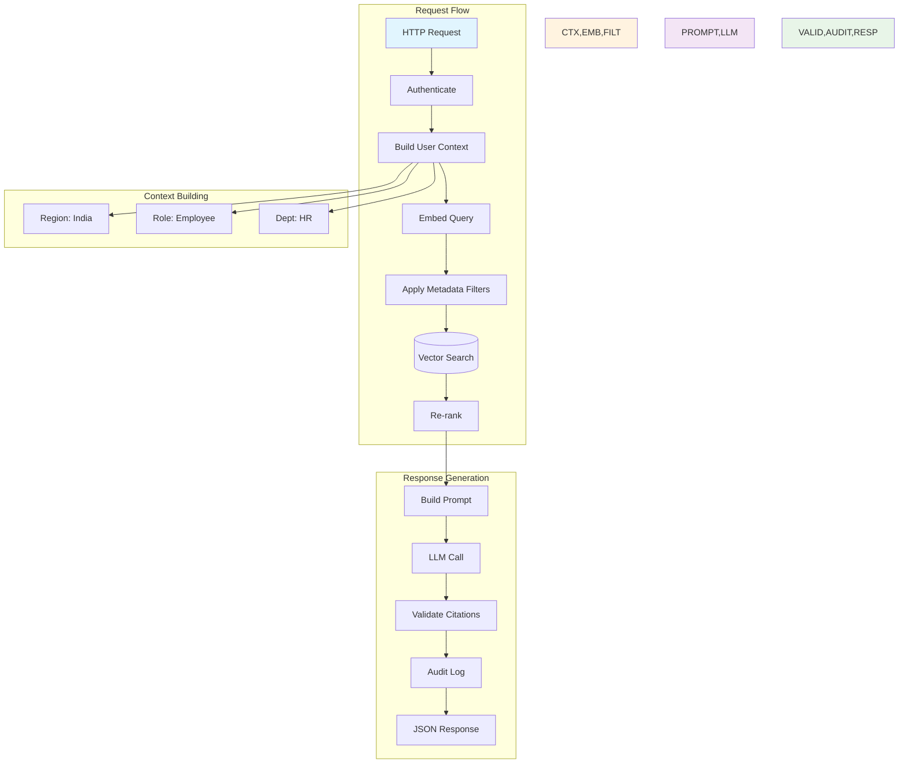

```mermaid
flowchart TD
    subgraph "Request Flow"
        REQ[HTTP Request] --> AUTH[Authenticate]
        AUTH --> CTX[Build User Context]
        CTX --> EMB[Embed Query]
        EMB --> FILT[Apply Metadata Filters]
        FILT --> VS[(Vector Search)]
        VS --> RANK[Re-rank]
    end
    
    subgraph "Context Building"
        CTX --> REGION[Region: India]
        CTX --> ROLE[Role: Employee]
        CTX --> DEPT[Dept: HR]
    end
    
    subgraph "Response Generation"
        RANK --> PROMPT[Build Prompt]
        PROMPT --> LLM[LLM Call]
        LLM --> VALID[Validate Citations]
        VALID --> AUDIT[Audit Log]
        AUDIT --> RESP[JSON Response]
    end
    
    style REQ fill:#e1f5fe
    style CTX,EMB,FILT fill:#fff3e0
    style PROMPT,LLM fill:#f3e5f5
    style VALID,AUDIT,RESP fill:#e8f5e8
```