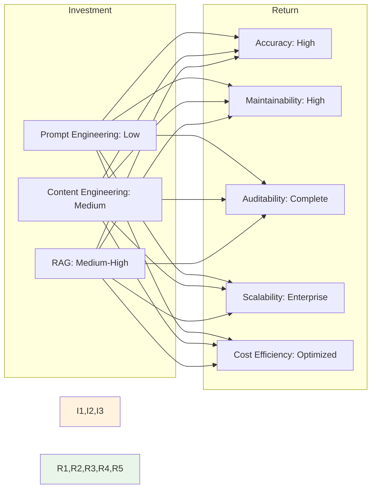

```mermaid
graph LR
    subgraph "Investment"
        I1[Prompt Engineering: Low]
        I2[Content Engineering: Medium]
        I3[RAG: Medium-High]
    end
    
    subgraph "Return"
        R1[Accuracy: High]
        R2[Maintainability: High]
        R3[Auditability: Complete]
        R4[Scalability: Enterprise]
        R5[Cost Efficiency: Optimized]
    end
    
    I1 & I2 & I3 --> R1 & R2 & R3 & R4 & R5
    
    style I1,I2,I3 fill:#fff3e0
    style R1,R2,R3,R4,R5 fill:#e8f5e8
```