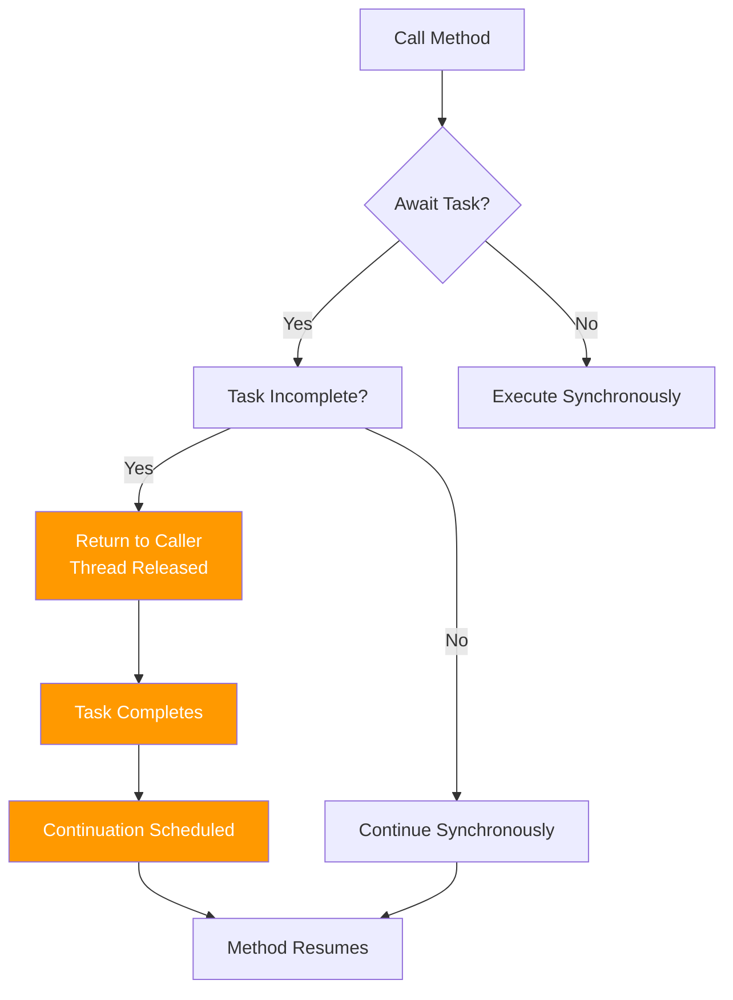

# Mermaid Diagram 2: Untitled

```mermaid
graph TD
    A[Call Method] --> B{Await Task?}
    B -- Yes --> C[Task Incomplete?]
    C -- Yes --> D[Return to Caller<br/>Thread Released]
    C -- No --> E[Continue Synchronously]
    D --> F[Task Completes]
    F --> G[Continuation Scheduled]
    G --> H[Method Resumes]
    E --> H
    B -- No --> I[Execute Synchronously]
    
    style D fill:#ff9900,color:white
    style F fill:#ff9900,color:white
    style G fill:#ff9900,color:white
```
