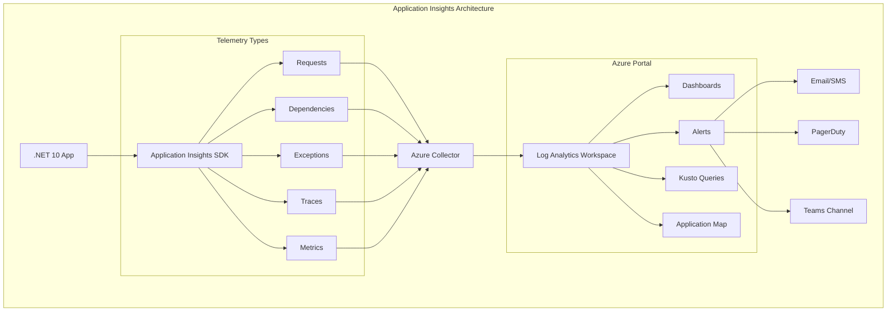

# Mermaid Diagram 6: Untitled

```mermaid
graph TD
    subgraph "Application Insights Architecture"
        App[.NET 10 App] --> SDK[Application Insights SDK]
        
        subgraph "Telemetry Types"
            SDK --> R[Requests]
            SDK --> D[Dependencies]
            SDK --> E[Exceptions]
            SDK --> T[Traces]
            SDK --> M[Metrics]
        end
        
        R --> Collector[Azure Collector]
        D --> Collector
        E --> Collector
        T --> Collector
        M --> Collector
        
        Collector --> LA[Log Analytics Workspace]
        
        subgraph "Azure Portal"
            LA --> Dashboards[Dashboards]
            LA --> Alerts[Alerts]
            LA --> Analytics[Kusto Queries]
            LA --> Maps[Application Map]
        end
        
        Alerts --> Email[Email/SMS]
        Alerts --> PagerDuty[PagerDuty]
        Alerts --> Teams[Teams Channel]
    end
```
