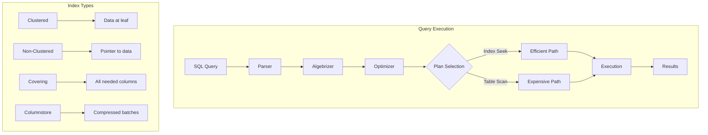

# Mermaid Diagram 7: Untitled

```mermaid
graph TD
    subgraph "Query Execution"
        A[SQL Query] --> B[Parser]
        B --> C[Algebrizer]
        C --> D[Optimizer]
        D --> E{Plan Selection}
        E -->|Index Seek| F[Efficient Path]
        E -->|Table Scan| G[Expensive Path]
        F --> H[Execution]
        G --> H
        H --> I[Results]
    end
    
    subgraph "Index Types"
        J[Clustered] --> K[Data at leaf]
        L[Non-Clustered] --> M[Pointer to data]
        N[Covering] --> O[All needed columns]
        P[Columnstore] --> Q[Compressed batches]
    end
```
