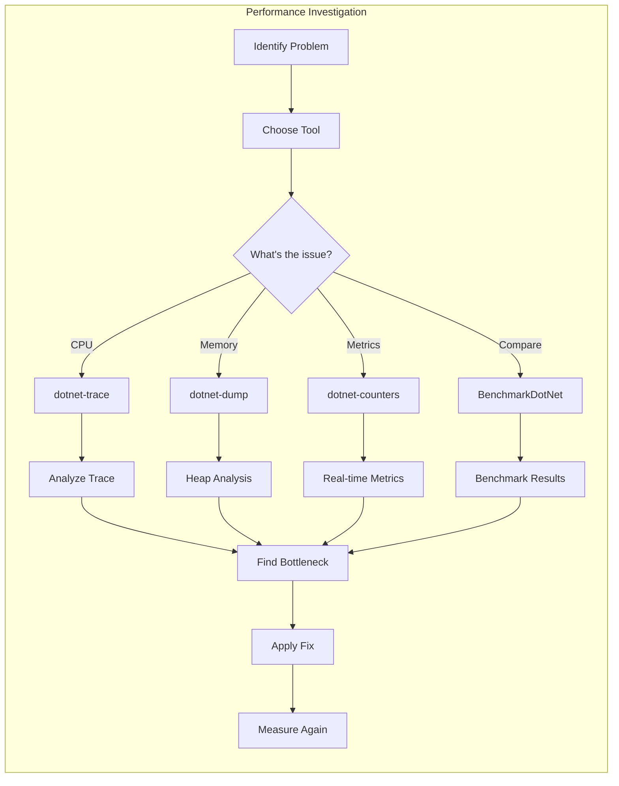

# Mermaid Diagram 10: dotnet-trace - Performance tracing

```mermaid
graph LR
    subgraph "Performance Investigation"
        A[Identify Problem] --> B[Choose Tool]
        
        B --> C{What's the issue?}
        C -->|CPU| D[dotnet-trace]
        C -->|Memory| E[dotnet-dump]
        C -->|Metrics| F[dotnet-counters]
        C -->|Compare| G[BenchmarkDotNet]
        
        D --> H[Analyze Trace]
        E --> I[Heap Analysis]
        F --> J[Real-time Metrics]
        G --> K[Benchmark Results]
        
        H --> L[Find Bottleneck]
        I --> L
        J --> L
        K --> L
        
        L --> M[Apply Fix]
        M --> N[Measure Again]
    end
```
