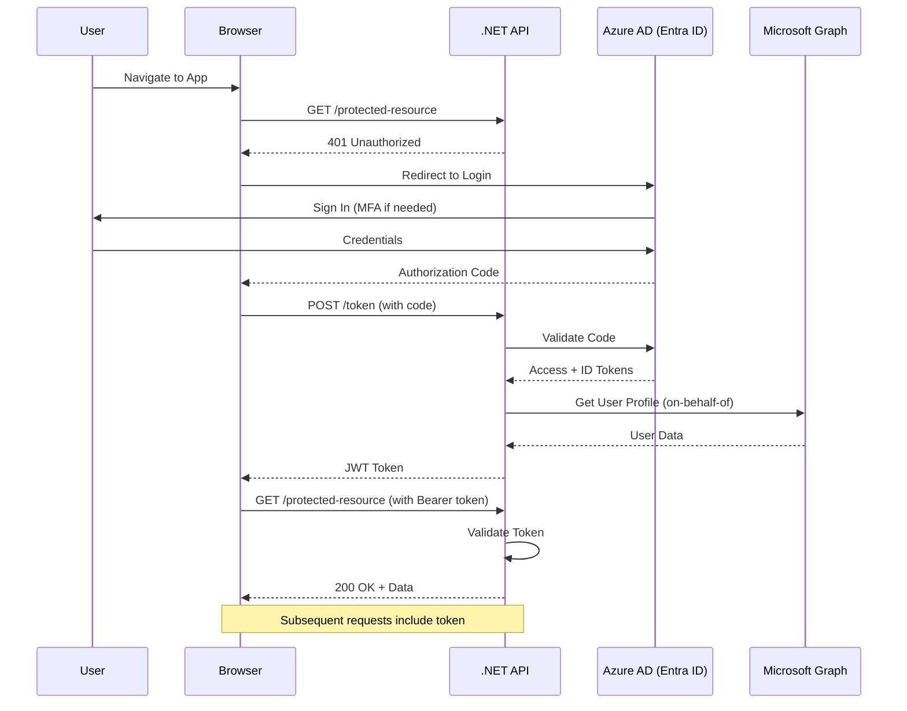

# Mermaid Diagram 12: Untitled

```mermaid
sequenceDiagram
    participant User
    participant Browser
    participant API as .NET API
    participant AzureAD as Azure AD (Entra ID)
    participant Graph as Microsoft Graph
    
    User->>Browser: Navigate to App
    Browser->>API: GET /protected-resource
    API-->>Browser: 401 Unauthorized
    
    Browser->>AzureAD: Redirect to Login
    AzureAD->>User: Sign In (MFA if needed)
    User->>AzureAD: Credentials
    
    AzureAD-->>Browser: Authorization Code
    Browser->>API: POST /token (with code)
    API->>AzureAD: Validate Code
    AzureAD-->>API: Access + ID Tokens
    
    API->>Graph: Get User Profile (on-behalf-of)
    Graph-->>API: User Data
    
    API-->>Browser: JWT Token
    Browser->>API: GET /protected-resource (with Bearer token)
    API->>API: Validate Token
    API-->>Browser: 200 OK + Data
    
    Note over Browser,API: Subsequent requests include token
```
