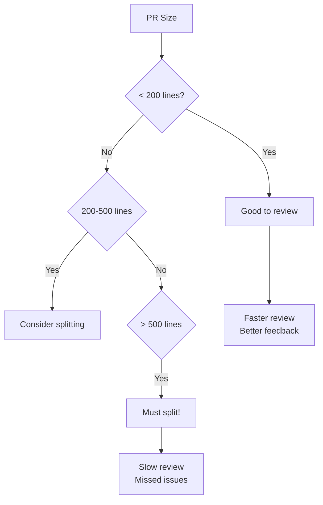

# Mermaid Diagram 14: Updates

```mermaid
graph TD
    A[PR Size] --> B{< 200 lines?}
    B -->|Yes| C[Good to review]
    B -->|No| D{200-500 lines}
    D -->|Yes| E[Consider splitting]
    D -->|No| F{> 500 lines}
    F -->|Yes| G[Must split!]
    
    C --> H[Faster review<br/>Better feedback]
    G --> I[Slow review<br/>Missed issues]
```
