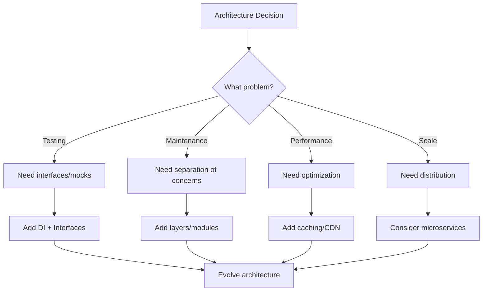

# Mermaid Diagram 15: Architecture Decision Framework:

```mermaid
graph TD
    A[Architecture Decision] --> B{What problem?}
    
    B -->|Testing| C[Need interfaces/mocks]
    B -->|Maintenance| D[Need separation of concerns]
    B -->|Performance| E[Need optimization]
    B -->|Scale| F[Need distribution]
    
    C --> G[Add DI + Interfaces]
    D --> H[Add layers/modules]
    E --> I[Add caching/CDN]
    F --> J[Consider microservices]
    
    G --> K[Evolve architecture]
    H --> K
    I --> K
    J --> K
```
