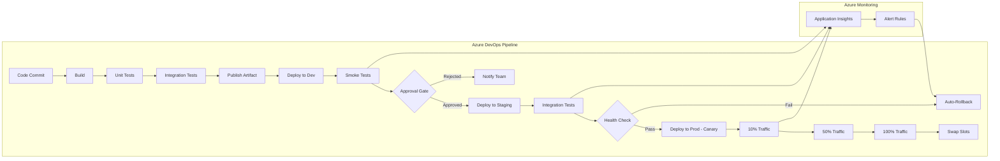

# Mermaid Diagram 17: Untitled

```mermaid
graph LR
    subgraph "Azure DevOps Pipeline"
        A[Code Commit] --> B[Build]
        B --> C[Unit Tests]
        C --> D[Integration Tests]
        D --> E[Publish Artifact]
        
        E --> F[Deploy to Dev]
        F --> G[Smoke Tests]
        
        G --> H{Approval Gate}
        H -->|Approved| I[Deploy to Staging]
        H -->|Rejected| J[Notify Team]
        
        I --> K[Integration Tests]
        K --> L{Health Check}
        L -->|Pass| M[Deploy to Prod - Canary]
        L -->|Fail| N[Auto-Rollback]
        
        M --> O[10% Traffic]
        O --> P[50% Traffic]
        P --> Q[100% Traffic]
        Q --> R[Swap Slots]
    end
    
    subgraph "Azure Monitoring"
        G --> AI[Application Insights]
        K --> AI
        O --> AI
        AI --> Alerts[Alert Rules]
        Alerts --> N
    end
```
