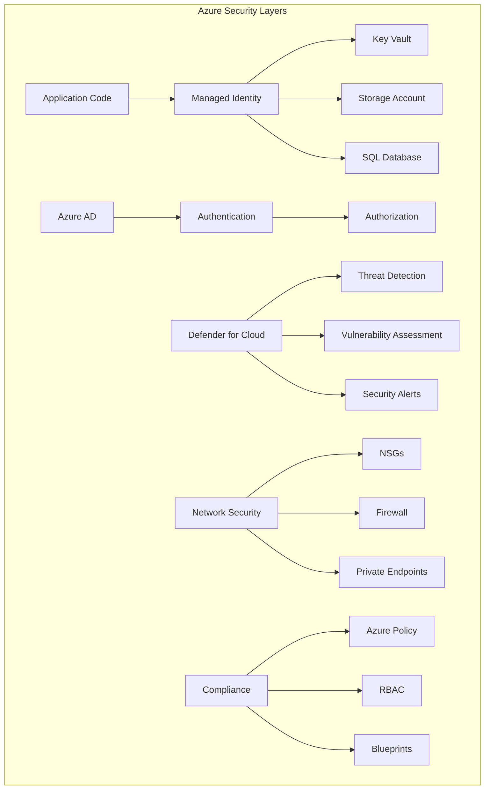

# Mermaid Diagram 19: Untitled

```mermaid
graph TD
    subgraph "Azure Security Layers"
        A[Application Code] --> B[Managed Identity]
        B --> C[Key Vault]
        B --> D[Storage Account]
        B --> E[SQL Database]
        
        F[Azure AD] --> G[Authentication]
        G --> H[Authorization]
        
        I[Defender for Cloud] --> J[Threat Detection]
        I --> K[Vulnerability Assessment]
        I --> L[Security Alerts]
        
        M[Network Security] --> N[NSGs]
        M --> O[Firewall]
        M --> P[Private Endpoints]
        
        Q[Compliance] --> R[Azure Policy]
        Q --> S[RBAC]
        Q --> T[Blueprints]
    end
```
