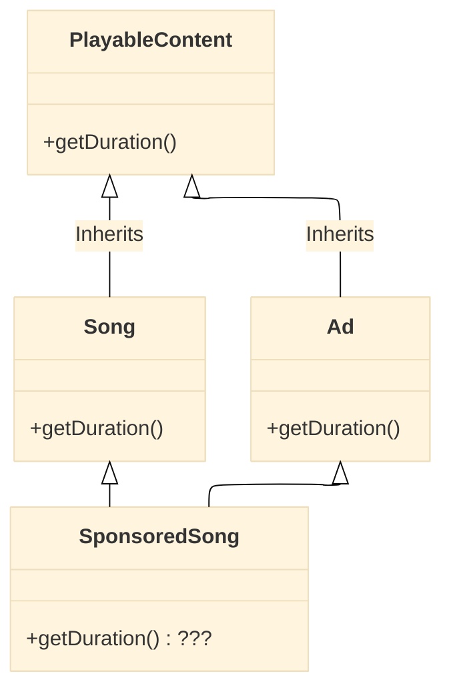

# Mermaid Diagram 1: The "Diamond Problem" (Hybrid Inheritance)

```mermaid
---
config:
  theme: base
  layout: elk
---
classDiagram
direction TB
    class PlayableContent {
	    +getDuration()
    }

    class Song {
	    +getDuration()
    }

    class Ad {
	    +getDuration()
    }

    class SponsoredSong {
	    +getDuration() ???
    }

    PlayableContent <|-- Song : Inherits
    PlayableContent <|-- Ad : Inherits
    Song <|-- SponsoredSong
    Ad <|-- SponsoredSong
```
