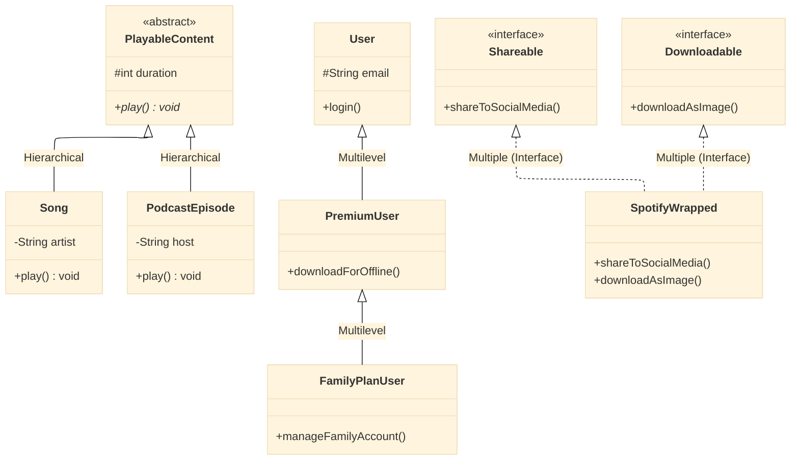

# Mermaid Diagram 2: The Mermaid Diagram (Healthy Relationships):

```mermaid
---
config:
  theme: base
  layout: elk
---
classDiagram
    class PlayableContent {
        <<abstract>>
        #int duration
        +play()* void
    }
    class Song {
        -String artist
        +play() void
    }
    class PodcastEpisode {
        -String host
        +play() void
    }
    class User {
        #String email
        +login()
    }
    class PremiumUser {
        +downloadForOffline()
    }
    class FamilyPlanUser {
        +manageFamilyAccount()
    }
    class Shareable {
        <<interface>>
        +shareToSocialMedia()
    }
    class Downloadable {
        <<interface>>
        +downloadAsImage()
    }
    class SpotifyWrapped {
        +shareToSocialMedia()
        +downloadAsImage()
    }

    PlayableContent <|-- Song : Hierarchical
    PlayableContent <|-- PodcastEpisode : Hierarchical
    User <|-- PremiumUser : Multilevel
    PremiumUser <|-- FamilyPlanUser : Multilevel
    Shareable <|.. SpotifyWrapped : Multiple (Interface)
    Downloadable <|.. SpotifyWrapped : Multiple (Interface)
```
