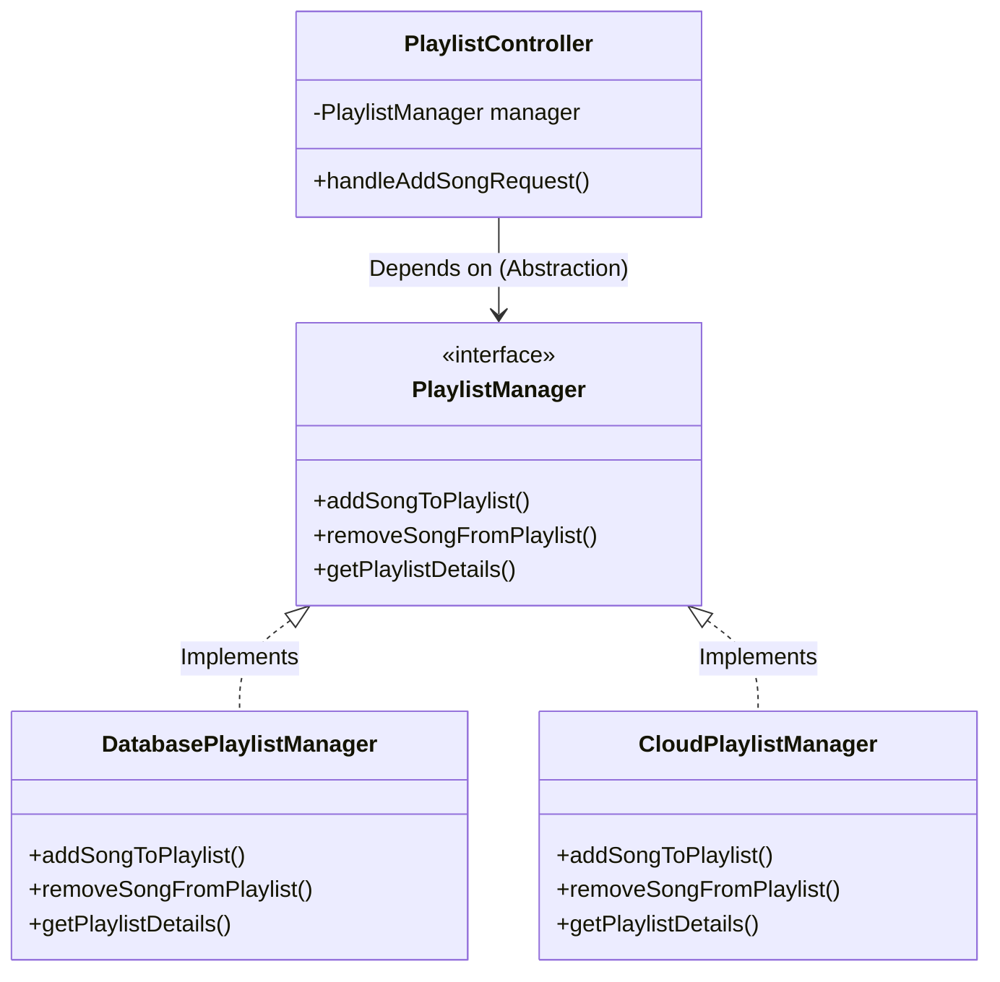

# Mermaid Diagram 3: The Mermaid Diagram (Abstraction in Action):

```mermaid
classDiagram
    class PlaylistManager {
        <<interface>>
        +addSongToPlaylist()
        +removeSongFromPlaylist()
        +getPlaylistDetails()
    }
    class DatabasePlaylistManager {
        +addSongToPlaylist()
        +removeSongFromPlaylist()
        +getPlaylistDetails()
    }
    class CloudPlaylistManager {
        +addSongToPlaylist()
        +removeSongFromPlaylist()
        +getPlaylistDetails()
    }
    class PlaylistController {
        -PlaylistManager manager
        +handleAddSongRequest()
    }

    PlaylistManager <|.. DatabasePlaylistManager : Implements
    PlaylistManager <|.. CloudPlaylistManager : Implements
    PlaylistController --> PlaylistManager : Depends on (Abstraction)
```
