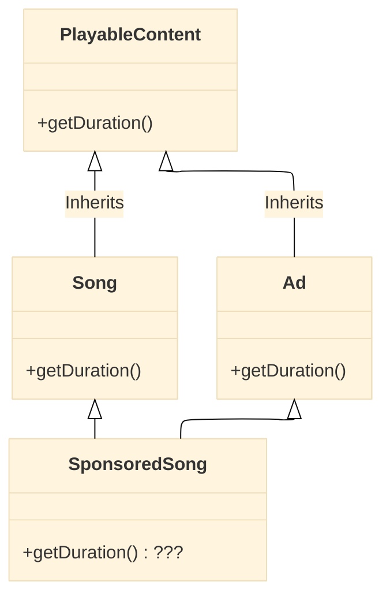
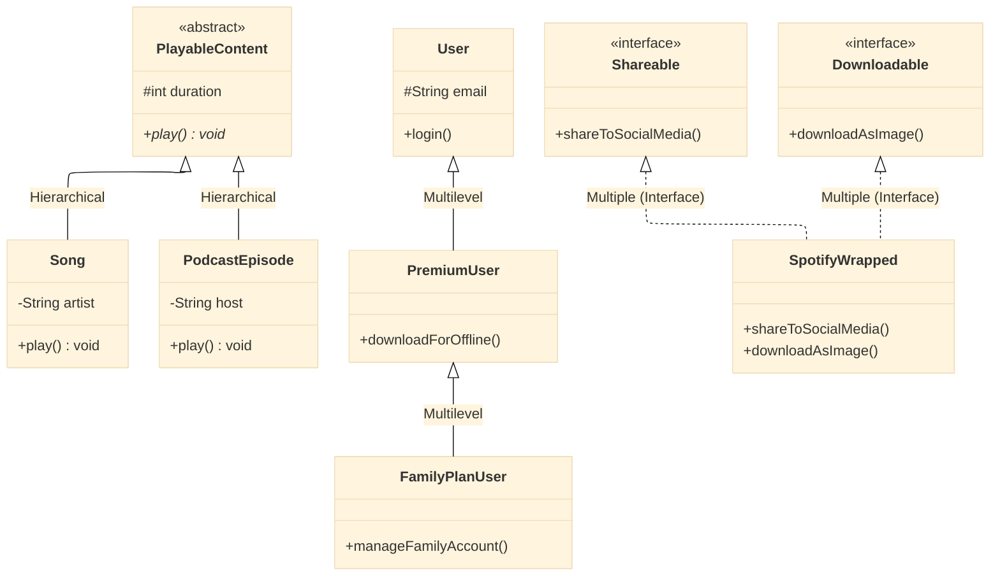
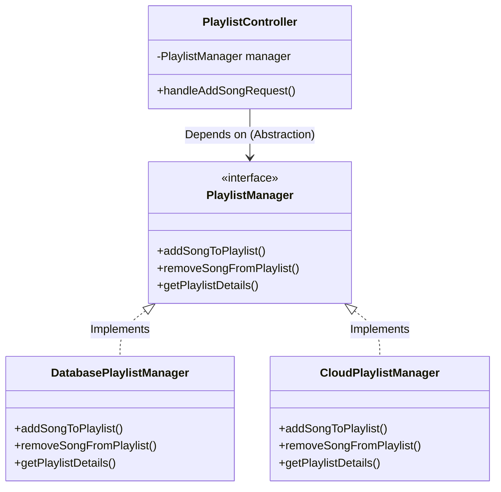

# Redefining OOPs: Beyond the Car and Animal Analogy

## Document Information
- **File Name:** Redefining OOPs: Beyond the Car and Animal Analogy.md
- **Total Words:** 2418
- **Estimated Reading Time:** 12 minutes

---

## Mermaid Diagram 1: The "Diamond Problem" (Hybrid Inheritance)

## Mermaid Diagram 2: The Mermaid Diagram (Healthy Relationships):

## Mermaid Diagram 3: The Mermaid Diagram (Abstraction in Action):

---
*This story was automatically generated from Redefining OOPs: Beyond the Car and Animal Analogy.md on 2026-03-05 00:50:42.*