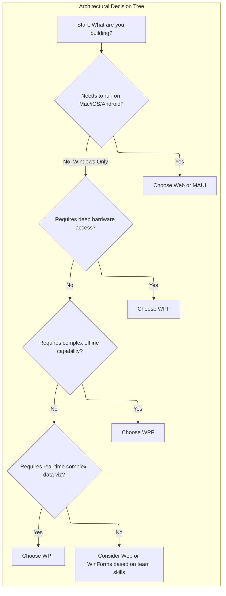

# diagram_01_the-architects-verdict-for-public-facing-co-fcec

```mermaid
---
config:
  theme: default
  layout: elk
---
flowchart TB
 subgraph subGraph0["Architectural Decision Tree"]
        B{"Needs to run on Mac/iOS/Android?"}
        A["Start: What are you building?"]
        C["Choose Web or MAUI"]
        D{"Requires deep hardware access?"}
        E["Choose WPF"]
        F{"Requires complex offline capability?"}
        G["Choose WPF"]
        H{"Requires real-time complex data viz?"}
        I["Choose WPF"]
        J["Consider Web or WinForms based on team skills"]
  end
    A --> B
    B -- Yes --> C
    B -- No, Windows Only --> D
    D -- Yes --> E
    D -- No --> F
    F -- Yes --> G
    F -- No --> H
    H -- Yes --> I
    H -- No --> J
```
