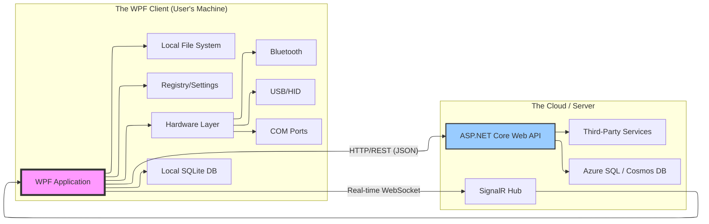

# diagram_02_a-modern-wpf-application-is-not-an-island-it-sits-69e3

```mermaid
---
config:
  theme: default
  layout: elk
---
graph LR
    subgraph "The WPF Client (User's Machine)"
        A[WPF Application] --> B[Local SQLite DB];
        A --> C[Local File System];
        A --> D[Registry/Settings];
        A --> E[Hardware Layer];
        E --> F[COM Ports];
        E --> G[USB/HID];
        E --> H[Bluetooth];
    end

    subgraph "The Cloud / Server"
        I[ASP.NET Core Web API];
        J[Azure SQL / Cosmos DB];
        K[Third-Party Services];
        L[SignalR Hub];
    end

    A -- "HTTP/REST (JSON)" --> I;
    I --> J;
    I --> K;
    A -- "Real-time WebSocket" --> L;
    L --> A;
    
    style A fill:#f9f,stroke:#333,stroke-width:4px
    style I fill:#9cf,stroke:#333,stroke-width:2px
```
